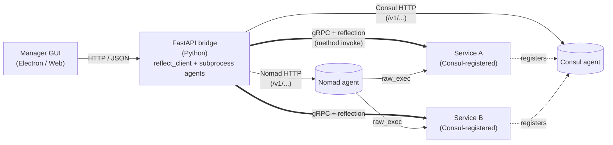

# Microservice Manager GUI

A Bootstrap-based desktop / web app that wraps the FastAPI bridge with
a friendly UX for **operating** the runtime (start/stop Consul + Nomad,
inspect services, submit jobs) and **building** new ones (the Service
Creator wizard, equivalent to `mb-scaffold`).

> ↑ Repo root: [`../../`](../..) — framework architecture lives in
> [`../../docs/`](../../docs).

## What you can do here

| Task | Where |
|---|---|
| Start / stop Consul + Nomad agents, inspect cluster state, submit jobs | **Service Network** mode → see [Operating Consul + Nomad](docs/md/ops_consul_nomad.md) |
| Generate a new service scaffold (proto + domain + adapter + clients + Nomad HCL) | **Service Creator** mode → see [Service Creator wizard guide](docs/md/service_creator.md) |
| Inspect a running service, browse its gRPC methods, send test calls | **Services** mode (covered in the Operating doc above) |
| Use the in-app help (lighter, embedded inside the GUI itself) | Click the **?** in the navbar — renders `web/docs/help.html` |

## Prerequisites

| Required | Why | Verify |
|---|---|---|
| **Python** 3.10+ | FastAPI bridge that the GUI talks to | `python --version` |
| **Node.js** 18 LTS or newer + **npm** | Electron desktop wrapper + dependency install | `node --version` &nbsp; `npm --version` |
| **Consul** + **Nomad** binaries on `%PATH%` | The GUI's Service Network tab launches and connects to them | `consul --version` &nbsp; `nomad --version` |
| **MicroserviceBase** (this repo's Python package) | Provides the FastAPI bridge module | `python -c "import MicroserviceBase; print(MicroserviceBase.__version__)"` |

For Consul + Nomad install steps see the [repo README](../../README.md#consul--nomad-install) — won't repeat them here.

## Install (step-by-step)

### 1. Install Node.js + npm

Pick one method:

#### A. Manual download (recommended on locked-down dev machines)

1. Go to <https://nodejs.org/en/download> → pick "LTS" → Windows installer (.msi).
2. Run the installer. Defaults are fine. Tick *"Automatically install the necessary tools"* if you might build native modules later (otherwise leave it off — saves ~3 GB of disk).
3. Open a NEW terminal and verify:

   ```cmd
   node --version
   npm --version
   ```

   Expect `v18.x` or newer for Node, `10.x` or newer for npm.

#### B. `winget` (Windows 10/11 with App Installer)

```cmd
winget install --id OpenJS.NodeJS.LTS -e
```

#### C. `nvm-windows` (if you juggle Node versions)

1. Install nvm-windows: <https://github.com/coreybutler/nvm-windows/releases> → `nvm-setup.exe`.
2. Pick + activate an LTS:

   ```cmd
   nvm install 20.18.0
   nvm use 20.18.0
   node --version
   ```

### 2. Install Python deps (once per environment)

From the repo root (`microsoft-base-develop/`):

```cmd
pip install --no-deps --no-build-isolation .
```

This installs `MicroserviceBase` (the framework that includes the bridge module). If you're on a corporate Python like `%RobotPythonPath%`, replace the bare `pip` with the absolute interpreter path:

```cmd
"%RobotPythonPath%\python" -m pip install --no-deps --no-build-isolation .
```

Verify:

```cmd
python -c "from MicroserviceBase.adapters.ui_bridge import fastapi_bridge; print('bridge module ok')"
```

### 3. Install Electron + GUI dependencies (once)

From this folder (`MicroserviceManagerGUI/`):

```cmd
cd MicroserviceBase\MicroserviceManagerGUI
npm install
```

First run downloads Electron (~80–120 MB) and a handful of dev tools. Subsequent `npm install` calls are instant.

Behind a corporate proxy? Configure npm before `install`:

```cmd
npm config set proxy http://127.0.0.1:3128
npm config set https-proxy http://127.0.0.1:3128
:: optional: skip strict TLS for self-signed proxy certs
npm config set strict-ssl false
```

### 4. (Optional) Install gRPC tooling for the Service Creator wizard

The Service Creator's "Import .proto…" feature parses files via `grpc_tools.protoc`. Already in the framework's deps, but verify:

```cmd
python -m grpc_tools.protoc --version
```

### 5. Sanity check

Run one of the launch commands from the "Two ways to launch" section below. If everything installs cleanly, the GUI opens and the navbar pills (Bridge / Consul / Nomad) report status within ~2 seconds.

## Two ways to launch

| Mode | Command | When |
|---|---|---|
| **Electron desktop** | `npm start` | Native window with system tray and bundled bridge auto-start |
| **Browser + Python bridge** | `python -m MicroserviceBase.adapters.ui_bridge.fastapi_bridge` then open `http://127.0.0.1:1112` | Headless boxes, shared sessions, existing Python env |

Both modes are fed by the same FastAPI bridge — what you do in one is
visible in the other.

## Documentation map

```
MicroserviceManagerGUI/
├── README.md / README.html         ← you are here
├── docs/                           ← long-form, GitHub-renderable
│   ├── md/   index.md   ops_consul_nomad.md   service_creator.md
│   ├── html/ index.html ops_consul_nomad.html service_creator.html
│   └── img/  (18 screenshots used by the docs above)
└── web/
    └── docs/
        ├── help.html               ← embedded in-app help (rendered
        │                             inside the running GUI when the
        │                             user clicks the ? button)
        └── img/  (10 screenshots)
```

The **long-form docs** in `docs/` are the canonical reference — they
render as standalone pages on GitHub, link out to the rest of the repo,
and cover material the in-app help skips (CLI equivalents, REST API,
troubleshooting depth).

The **in-app help** at `web/docs/help.html` is intentionally smaller —
it loads inside the running GUI so users don't have to context-switch
out to a browser tab. It links to the long-form docs for anything
beyond a quick lookup.

## Documentation entry points

- **[Doc index](docs/md/index.md)** — landing page with all GUI guides
- **[Operating Consul + Nomad](docs/md/ops_consul_nomad.md)** — Service
  Network tab, agent lifecycle, jobs / nodes / services dashboards,
  REST API equivalents
- **[Service Creator wizard](docs/md/service_creator.md)** — the 4-step
  scaffold-generation wizard, with screenshots of each step
- **HTML twins** — every `.md` has a `.html` sibling under `docs/html/`
  with sidebar nav, copy-to-clipboard buttons, and active-section
  highlighting

## Source layout

| Path | What |
|---|---|
| `web/` | Browser-renderable assets (HTML / CSS / JS) — works in Electron and as a static site served by the bridge |
| `web/index.html` | Main shell (mode toggle, navbar, panels) |
| `web/js/` | App scripts — `app.js`, `GrpcClient.js`, `ConsulDashboard.js`, `NomadDashboard.js`, `ServiceCreator.js`, etc. |
| `web/services/` | Per-service GUI plugins loaded dynamically |
| `web/docs/help.html` | Embedded in-app help |
| `electron/` | Electron wrapper (preload, IPC) |
| `dist/` | Built Electron output (gitignored) |
| `build.bat` / `build.sh` | Bundle scripts |

## Architecture

The GUI is a thin client over the FastAPI bridge at
`http://127.0.0.1:1112`. Every action in the UI maps to a bridge HTTP
endpoint — see the **CLI equivalents** table at the bottom of
[`docs/md/ops_consul_nomad.md`](docs/md/ops_consul_nomad.md) for the
full list.



What the diagram shows:

- **Solid arrows** — bridge calls outbound: HTTP/JSON to Consul + Nomad APIs, gRPC to running services (with reflection so it can introspect methods at runtime).
- **Thick arrows** — the gRPC channels the bridge opens when the user clicks "Call method" on a service in the Services tab. Pooled per-service, reused across calls.
- **Dotted arrows** — service-to-Consul self-registration, done by the C++ `ServiceRunner` at startup (not via Nomad's `service { }` block, which has stricter name validation).
- **Nomad → Service** — agent spawns the service via `raw_exec` when a job is submitted; receives shutdown signals back through the lifecycle hooks.
