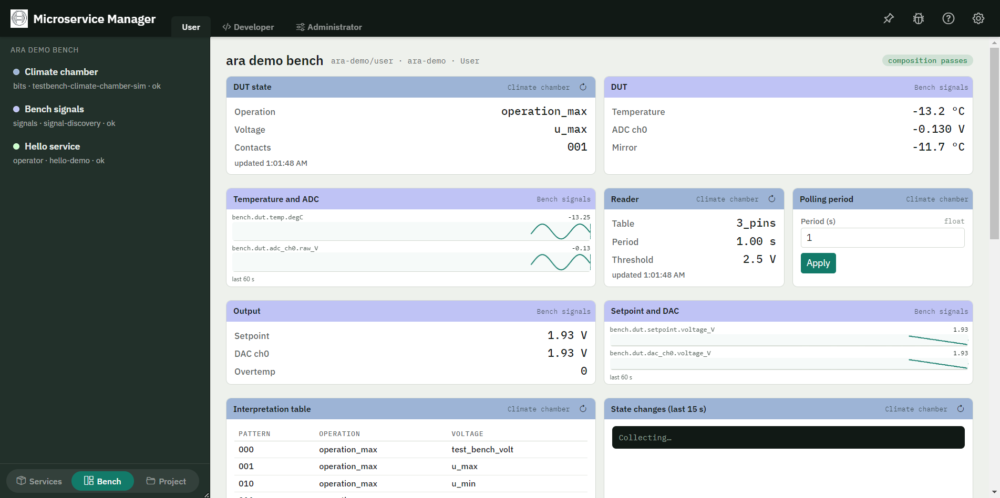

# Bench demo

> 📄 *Also available as HTML:* [`../html/bench_demo.html`](../html/bench_demo.html)

A ten-minute demo of the bench on live services: three components from
three layers on one screen, values arriving over gRPC and over the signal
stream, a command sent from a tile, and a service's own HTML panel running
in a sandbox.

Everything here runs against services that are really deployed — Nomad
runs them, Consul finds them, the bridge talks to them. Nothing in the
bench is mocked; only the devices behind the services are.



## What the audience sees

| On screen | The point |
|---|---|
| Three services in the left rail, each with its layer | A bench is composed from what is registered, not hard-coded |
| **DUT state**, **Reader**, **Interpretation table** | A service ships a manifest; the shell renders the tiles from it — no GUI code |
| **DUT**, **Temperature and ADC**, **Output**, **Setpoint and DAC** | Live signals at up to 10 Hz, from three signal services, through one subscription each |
| **Polling period** → *Apply* | A tile issues a gRPC call and shows the answer |
| **Hello panel** | A service's own HTML, in a sandboxed frame that cannot touch the shell |
| **composition passes** badge | The bench checked the manifests against the contract before rendering |

## Before the demo

Three things must be running. The first two are the standing environment;
only the third is specific to this demo.

1. **The demo cluster** — one Nomad server on `http://127.0.0.1:4746`
   with three clients, and three Consul agents (`8500`–`8502`). It is
   `nomad/jobs/demo_cluster.nomad` in the `taf_repo_proposal`
   repository; start it from the GUI as described there.
2. **The climate chamber** — `testbench-climate-chamber-sim`, the
   chamber job of the same repository, on client1.
3. **The demo services** — [`examples/ara_demo.nomad.hcl`](https://github.com/test-fullautomation/python-microservice-base/blob/develop/examples/ara_demo.nomad.hcl):
   the signal cluster and the hello service.

Submit the third one to the demo server, **not** to the bootstrap agent
the GUI starts for itself:

The job needs one setting, `base_repo`: where this repository is checked
out (forward slashes, no spaces). The taf checkout comes from the node's
`meta.repo_root`, which the demo cluster sets.

- In the GUI: **Nomad → Connect to Existing Cluster →
  `http://127.0.0.1:4746` → Submit Job →** pick the file, replace
  `<path-to-this-repository>` with your checkout, Submit.
- Or from a terminal:

  ```
  nomad job run -address=http://127.0.0.1:4746 -var base_repo=<path-to-this-repository> examples/ara_demo.nomad.hcl
  ```

Consul then lists `testbench-climate-chamber-sim`, `signal-discovery` and
`hello-demo` on `http://127.0.0.1:8500`, each carrying the `gui` meta that
names its component.

### The composition

The bench layout is stored per user
(`%APPDATA%\devatservgui\compositions`). Store it once before the demo:
**Bench → Edit composition**, set *Bench* to `ara-demo` and *Role* to
*User*, paste the JSON below, press **Check** (the editor lints it against
the contract) and **Save**.

```json
{
  "composition": "ara-demo/user",
  "title": "ara demo bench",
  "shell": "^2.3",
  "role": "user",
  "plugins": ["charts"],
  "components": [
    { "from": "consul", "service": "testbench-climate-chamber-sim" },
    { "from": "consul", "service": "signal-discovery" },
    { "from": "consul", "service": "hello-demo" }
  ],
  "order": [
    "bits.climate-chamber/state",
    "signals.bench/values",
    "signals.bench/trend",
    "bits.climate-chamber/reader",
    "bits.climate-chamber/period",
    "signals.bench/output",
    "signals.bench/outtrend",
    "bits.climate-chamber/table",
    "bits.climate-chamber/changes",
    "*"
  ]
}
```

The same thing from a terminal, if you prefer:

```
curl -X PUT http://127.0.0.1:1112/api/ui/compositions/ara-demo/user ^
     -H "Content-Type: application/json" -d @ara-demo-user.json
```

Nothing breaks without it — the bench then shows every component of every
selected service in manifest order, which is a fine demo too. The stored
composition only fixes the order, so the same thing is on screen every
time.

### Check before you present

- Consul `http://127.0.0.1:8500/v1/agent/services` lists the three services.
- The bridge LED in the navbar is green.
- `http://127.0.0.1:1112/api/signals/catalog?consul=http://127.0.0.1:8500`
  answers `"status": "ok"` with 13 signals. If it reports an address that
  is not `127.0.0.1`, the gRPC call is going through the corporate proxy —
  see [Troubleshooting](#troubleshooting).

## The walkthrough

Eight beats, about a minute each.

**1 · The bench is composed, not built.** Open **Bench** and pick
*ara demo bench*. Point at the left rail: three services, three layers
(`bits`, `signals`, `operator`). None of them knows about the others, and
none of them ships GUI code for this screen. The **composition passes**
badge says the shell validated every manifest against the contract first.

**2 · A tile is a manifest entry.** Click any chamber tile: the dock on
the right names the component (`bits.climate-chamber`), the capabilities it
asked for, the gRPC service it is bound to and the instance it is talking
to. Put the service's `component.json` next to it — its `tiles` array is
exactly what is on screen: `live-status`, `command-form`, `table`, `log`.
Adding a tile is adding six lines of JSON to the service, with no shell
release.

**3 · Values arrive over gRPC.** **DUT state** and **Reader** re-read the
chamber every two and ten seconds; the timestamps under them tick. The
tiles say *which* RPC they call, so the bench is honest about where the
number came from.

**4 · Live signals are a different path.** **DUT** and **Output** are not
polling: the bench holds one subscription per signal service and the
values stream in at up to 10 Hz. The strips beside them
(**Temperature and ADC**, **Setpoint and DAC**) draw the last 60 seconds.
The setpoint sweeps 0 → 5 V a minute, and **DAC ch0** follows it — that
is `signal-out`'s graph doing the work, seen from the bench.

**5 · The strips are a plugin.** The two strip tiles are not a shell
feature: the **charts** plugin contributes the `signal-strip` kind, and
each strip runs in its own sandboxed frame. Turn it off under
**Administrator → Shell → Plugins**: the tiles then say which plugin they
need instead of disappearing. Turn it back on and they come back.

**6 · A tile sends a command.** In **Polling period**, set `0.5` and press
**Apply**. The field and its bounds are declared in the manifest, the call
goes out over gRPC, and the service's answer comes back in the tile.
**Reader** shows the new period on its next refresh.

**7 · A service can ship its own screen.** Scroll to **Hello panel**: the
service's own HTML and JavaScript, in a frame with an opaque origin that
cannot reach the shell's DOM, its storage, or the network. It talks to the
bench through one message channel, and a frame that hangs takes only its
own tile down — the rest of the bench keeps updating.

**8 · A different bench is a different file.** Open **Edit composition**.
The JSON on screen is the whole layout; press **Check** and the shell lints
it live — break a component id on purpose and it says which rule failed and
refuses to save. Change *Role* to *Developer*, cut the chamber
entry down to `{ "from": "consul", "service": "testbench-climate-chamber-sim",
"tiles": ["state"] }`, and save: a second bench, on the same services,
without touching a service or the shell.

## Reset between runs

```
nomad job stop -address=http://127.0.0.1:4746 -purge ara-demo
nomad job run  -address=http://127.0.0.1:4746 -var base_repo=<path-to-this-repository> examples/ara_demo.nomad.hcl
```

The chamber and the cluster can stay up. The reload button next to the
bench picker re-reads the composition and the manifests without restarting
anything.

## Troubleshooting

**The signal tiles say *reconnecting*.** The bench reaches live signals
over a WebSocket, and the desktop app's WebSocket handshake carries
`Origin: file://`. A bridge whose allow-list was configured by hand needs
both Electron spellings — `null` and `file://` — or the connection is
refused with `403`; see [the origin allow-list](index.md#bridge-security-allowed-origins).
The defaults for a loopback bridge include both.

**The catalog reports an address that is not `127.0.0.1`.** Nomad
advertises the host address by default, and gRPC to it is sent through the
corporate HTTP proxy, which refuses it. The demo job pins
`signal-discovery` to `127.0.0.1` for that reason; a service registered by
hand needs the same.

**A signal tile says *not in the catalog*.** The signal cluster is not
running, or it came up after the bench. The bench retries discovery; a
reload is faster.

**The bench shows every tile in manifest order.** No composition is stored
for the selected bench and role — see [The composition](#the-composition).
The note above the stage says so.
