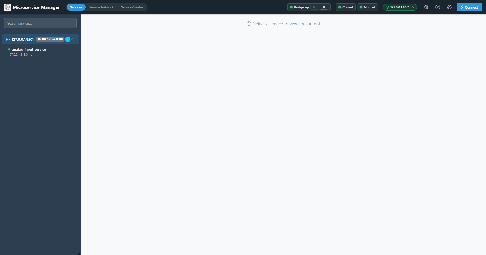
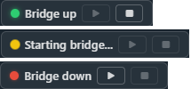
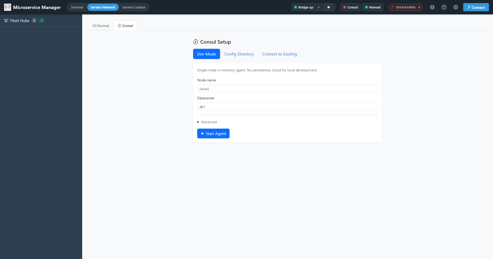
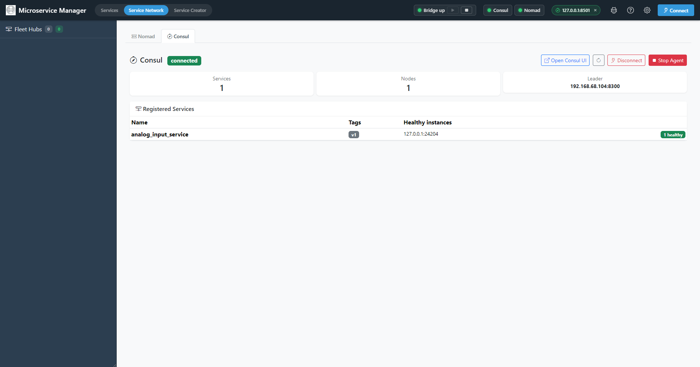
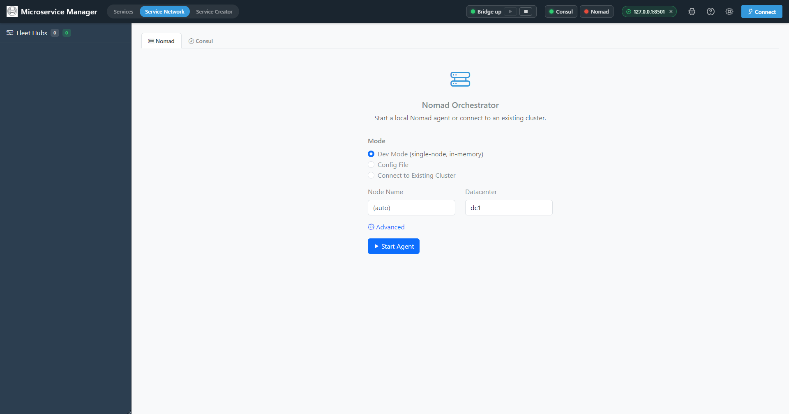
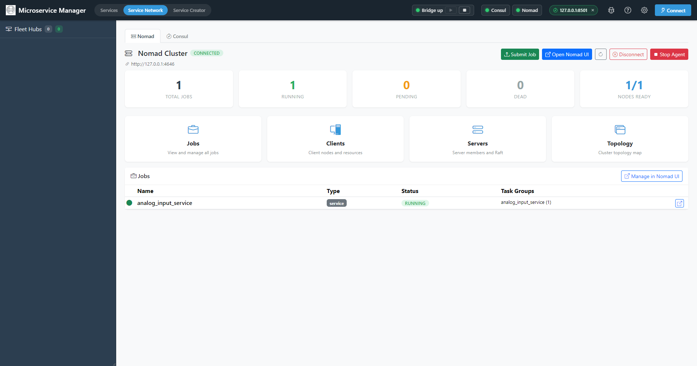
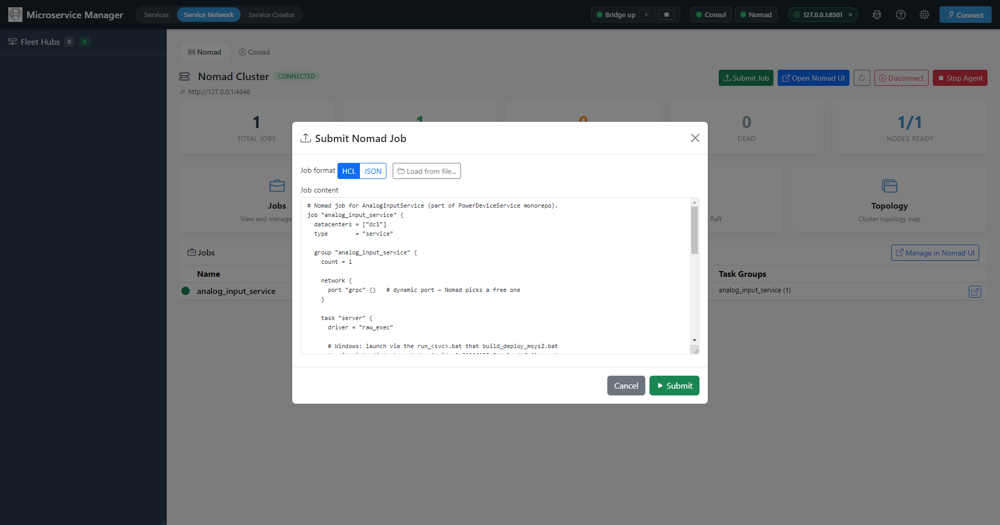

# Manager GUI — easy start & ops for Consul + Nomad

The **Microservice Manager GUI** is a Bootstrap-based web app that
wraps the FastAPI bridge with a desktop UX.  Use it as the easiest
on-ramp to:

- **Start, stop, and inspect** the Consul service registry and the
  Nomad orchestrator without remembering CLI flags.
- See live infrastructure status at a glance (LEDs in the navbar).
- Browse registered services, running jobs, and per-job logs in one
  place.
- Generate new service scaffolds (the
  [Service Creator wizard](service_creator.md) lives here too).

If you've been running `consul agent -dev` and `nomad agent -dev` by
hand in two terminals, this guide replaces those steps.

---

## Launching the Manager GUI

Two equivalent ways to run it:

| Mode | Command | Use when |
|---|---|---|
| **Electron (desktop)** | `cd MicroserviceBase\MicroserviceManagerGUI && npm start` | You want a native window, system tray, and auto-start of the bridge. |
| **Web (browser + bridge)** | `python -m MicroserviceBase.adapters.ui_bridge.fastapi_bridge` then open `http://127.0.0.1:1112` | You're on a headless machine, sharing a session, or already have a Python env. |

Both modes are fed by the same FastAPI bridge — what you do in one is
visible in the other.


*Manager GUI on first launch — mode toggle (Services / Service Network /
Service Creator) on the left of the navbar; Bridge LED + Start/Stop,
Consul + Nomad infra pills, and the connected-cluster chip on the right.*

The first thing the GUI shows in the navbar is the **Bridge LED**:


*The three Bridge LED states — green "Bridge up", amber "Starting bridge…",
red "Bridge down". Use the ▶ / ■ buttons to start or stop the bridge.*

| LED | Label | Meaning | Action |
|---|---|---|---|
| 🟢 | `Bridge up` | Bridge running and healthy | Nothing — proceed |
| 🟡 | `Starting bridge…` | Spawning / reconnecting | Wait a few seconds |
| 🔴 | `Bridge down` | Bridge process stopped | Click ▶ to start it (Electron mode); in web mode the bridge *is* the page server, so a red LED means you've lost the page |

---

## The three top-level modes

The mode toggle in the navbar switches between:

| Mode | What it's for |
|---|---|
| **Services** | Runtime management — view registered services, send test gRPC calls, watch real-time updates. |
| **Service Network** | Operate the infrastructure — start/stop Consul + Nomad, view jobs, view nodes. **This guide focuses here.** |
| **Service Creator** | Generate a new service scaffold via the 4-step wizard.  See [service_creator.md](service_creator.md). |

---

## Service Network: Consul tab

The Consul sub-tab has two render states:

### State 1 — Setup form (agent stopped)

When no agent is detected, you get a form with three start modes:


*Consul Setup — three tabs (Dev Mode / Config Directory / Connect to
Existing). Dev Mode just needs Node name and Datacenter; click
**Start Agent**.*

| Start mode | What it does | Use when |
|---|---|---|
| **Dev Mode** | Equivalent to `consul agent -dev -client=0.0.0.0 -ui` — single-node in-memory agent, no persistence. | Local dev — fastest path |
| **Config Directory** | Loads a `.hcl` / `.json` config directory (`-config-dir <path>`) | You have a real cluster config |
| **Connect to Existing** | Skip start, just point at an already-running Consul HTTP URL | Shared / managed Consul |

Defaults that match the rest of the framework:

- **HTTP port**: `8500` (matches the default `CONSUL_ADDR`)
- **Bind addr**: `0.0.0.0` (so other dev machines can reach it)
- **Datacenter**: `dc1` (matches the default Nomad datacenter)
- **Consul binary**: `consul` (resolved on `%PATH%`; override under
  **Advanced**)

Click **Start Agent** — the Consul pill in the navbar turns green
within a few seconds and the panel switches to the Connected dashboard.

### State 2 — Connected dashboard


*Consul connected — leader, node count, services count up top; live
**Registered Services** table below; **Open Consul UI** /
**Disconnect** / **Stop Agent** buttons in the top right.*

Shown once the agent is running.  Lists:

- **Leader** + node count + service count cards
- **Registered Services** table — name, tags (e.g. `v1`), healthy
  instance address:port, health-check status badge. This is the live
  source of truth used by gRPC clients with `useConsul=true`.
- **Open Consul UI** — opens the bundled Consul UI (`:8500/ui`) in a
  new browser window for deeper inspection.
- **Disconnect** / **Stop Agent** — Disconnect just detaches the GUI's
  pointer; Stop Agent sends a graceful shutdown to the process the GUI
  started.

---

## Service Network: Nomad tab

Same two-state pattern as Consul.

### State 1 — Setup form


*Nomad Setup — three radios (Dev Mode / Config File / Connect to
Existing Cluster). Dev Mode just needs Node Name and Datacenter; click
**Start Agent**.*

| Start mode | What it does |
|---|---|
| **Dev Mode** | Single-node, in-memory. Equivalent to `nomad agent -dev` with `raw_exec` enabled. |
| **Config File** | Loads an `.hcl` config (`-config <file>`) |
| **Connect to Existing Cluster** | Just point at a running Nomad HTTP URL |

Defaults:

- **HTTP port**: `4646`
- **Datacenter**: `dc1`
- **Nomad binary**: `nomad` (resolved on `%PATH%`; override under
  **Advanced**)

Heads-up for Windows dev: the Dev Mode start automatically writes a
`raw_exec`-enabled config so service `.hcl` files using
`driver = "raw_exec"` (the default for generated scaffolds) work.

### State 2 — Connected dashboard


*Nomad Cluster connected — counters across the top (Total / Running /
Pending / Dead / Nodes Ready), navigation tiles below (Jobs / Clients /
Servers / Topology), live jobs table at the bottom. Top-right buttons:
**Submit Job**, **Open Nomad UI**, **Disconnect**, **Stop Agent**.*

- **Counters** — Total Jobs, Running, Pending, Dead, Nodes Ready
- **Navigation tiles** — Jobs / Clients / Servers / Topology, each
  opens the matching Nomad UI panel
- **Jobs table** — every submitted job with type, status, task groups,
  and a per-row link to detail view
- **Submit Job** — paste an `.hcl` or pick a file (same as
  `nomad job run`); see screenshot below
- **Open Nomad UI** — opens the bundled Nomad UI (`:4646/ui`) in a new
  browser window


*Submit Job dialog — HCL or JSON toggle, **Load from file…** picks a
generated `deploy/<service>.nomad.hcl`, or paste content into the
textarea directly. **Submit** kicks off the job; the GUI then tracks
it in the Jobs table.*

For each generated service, the matching Nomad `.hcl` file lives in
`deploy/<service>.nomad.hcl`.  Submit it once via the GUI and the job
stays registered across bridge restarts.

---

## Navbar infra status pills

To the right of the Bridge chip there are two infrastructure pills
plus the connected-cluster chip:


*Navbar chips, all healthy — Bridge up + Consul + Nomad + the active
Consul cluster URL on the right.*

- LED color reflects the same health state as the dashboards:
  🟢 green = healthy, 🟡 amber = starting, ⚪ gray / 🔴 red = down.
- **Click a pill** to jump straight to its sub-tab — useful when you
  need to start an agent that another panel is waiting for.
- Polled every 5 seconds via `GET /api/consul/health` and
  `GET /api/nomad/health`. Both go gray whenever the bridge itself is
  down.

---

## Typical workflow

The fastest "open Manager GUI → run a generated service" path:

1. Launch the GUI (`npm start` or open `http://127.0.0.1:1112`).
2. **Service Network → Consul → Start (Dev mode)**.  Wait for the LED
   to turn green.
3. **Service Network → Nomad → Start (Dev mode)**.  Same.
4. In a terminal, generate a service (or use **Service Creator**):

   ```cmd
   python -m MicroserviceBase.tools.scaffold_cli ^
       --name DemoService --language cpp --gui widget --output .\out
   ```

5. Build it (`build_deploy_msys2.bat` or `build_qt_vcpkg.bat`).
6. **Nomad tab → Submit new job → pick `deploy\demo_service.nomad.hcl`.**
7. **Services tab** → DemoService appears, click to inspect / send
   test calls.

No CLI for Consul or Nomad needed.

---

## CLI equivalents

If you want to script the same operations (CI, batch scripts), every
GUI action maps to a bridge HTTP endpoint:

| GUI action | HTTP endpoint |
|---|---|
| Start Consul (Dev) | `POST /api/consul/agent/start` (body: `{mode: "dev", ...}`) |
| Stop Consul | `POST /api/consul/agent/stop` |
| Consul health | `GET /api/consul/health` |
| Discover services | `GET /api/consul/services` |
| Start Nomad (Dev) | `POST /api/nomad/agent/start` (body: `{mode: "dev", ...}`) |
| Stop Nomad | `POST /api/nomad/agent/stop` |
| Nomad health | `GET /api/nomad/health` |
| Submit job | `POST /api/nomad/jobs/submit` |
| Stop job | `POST /api/nomad/jobs/{id}/stop` |
| Job logs | `GET /api/nomad/jobs/{id}/logs` |

The bridge lives at `http://127.0.0.1:1112` by default.  Full schema
lives in `MicroserviceBase/adapters/ui_bridge/fastapi_bridge.py`.

The GUI also persists agent PIDs in `%TEMP%\msbase_*_agent.pid`, so
agents survive bridge restarts and a fresh GUI session can re-attach.

---

## Troubleshooting

| Symptom | Fix |
|---|---|
| Bridge LED stays red after `npm start` | Bridge port (1112) already in use. Run `netstat -ano \| findstr :1112` and kill the holder, or set `MB_BRIDGE_URL` to a different port. |
| "Port 8500 is already in use" when starting Consul | Another Consul instance is running. Stop it (`tasklist \| findstr consul`) or use **Connect to existing** with the running URL. |
| Same for port 4646 (Nomad) | Same fix pattern — stop the existing one or connect to it. |
| Consul LED green but no services listed | The service registered with a different Consul (check its `CONSUL_ADDR` env). The GUI shows the cluster the bridge is currently pointed at — switch via **Connect** in the navbar. |
| Nomad job stays "pending" | Driver mismatch (Windows can't run `exec`/`docker` jobs without setup). Generated scaffolds use `raw_exec` which dev mode enables automatically; if you bring your own config, add the `raw_exec` plugin block. |
| GUI shows "Agent already running (PID …)" but the LED is gray | Stale PID file at `%TEMP%\msbase_consul_agent.pid` or `msbase_nomad_agent.pid`. Delete it and click Start again. |
