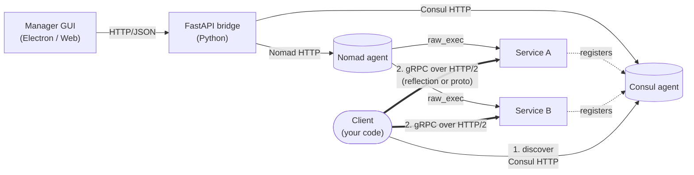

# MicroserviceBase
[](http://www.apache.org/licenses/LICENSE-2.0.html)

**A Python + C++ framework for building, registering, discovering, and orchestrating gRPC microservices on Consul and Nomad.**

MicroserviceBase provides the foundation for creating microservices that communicate over gRPC, with a built-in **Manager GUI** for monitoring, **Consul-based service discovery** for dynamic registration, and **Nomad-based orchestration** for lifecycle management. Whether you're building test automation infrastructure, managing distributed services, or creating IoT device controllers, MicroserviceBase gives you the tools to develop and deploy microservices reliably.

## Why MicroserviceBase?

### The Problem

In a typical distributed test-automation or service-oriented environment:

```
Developer A builds Service X  ──────►  Hardcoded gRPC channels everywhere
Developer B builds Service Y  ──────►  Different proto schema, incompatible
Operator wants to see services ──────►  No central view, manual discovery
User wants to call a service   ──────►  Must know exact host:port + method names
Service X changes its API      ──────►  All callers break silently
A service crashes              ──────►  No supervisor, no auto-restart
Building the same scaffold     ──────►  Domain + adapter + main + Nomad HCL by hand each time
```

**Common issues:**
- **Tight coupling** — services hardcode connection strings, message formats, and routing
- **No discovery** — callers must know the exact host:port of every service
- **No API introspection** — no way to discover what methods a service offers without reading the .proto
- **Incompatible messages** — each service invents its own request/response schema
- **No central visibility** — no dashboard to see what services are running
- **Lifecycle by hand** — no supervisor, manual restart on crash, port conflicts

### The Solution

MicroserviceBase provides a complete framework:



The **two-step client flow** (numbered edges in the diagram):

1. **Discover** — client asks Consul "where is `ServiceA`?" via the Consul HTTP API (`/v1/health/service/<name>?passing`) and gets back a healthy `host:port`. Same lookup the Manager GUI uses.
2. **Call** — client opens a gRPC channel to that `host:port` and invokes methods (with reflection if the server ships `grpc++_reflection`, or a local `.proto` via `LocalProtoClient`).

Step 1 lets the client survive Nomad reschedules without restarting — the next Consul lookup returns the new `host:port`. No service-IP hardcoding anywhere.

- **Service-to-service** uses gRPC over HTTP/2 — point-to-point, no central message broker
- **Consul** is the canonical service catalog — services register on startup, deregister on shutdown, health-check every few seconds
- **Nomad** runs services as `raw_exec` jobs (Windows + Linux) with dynamic port allocation
- **Method discovery** is automatic via gRPC server reflection — clients enumerate services + methods at runtime, no `.proto` needed on the caller side
- **Hexagonal architecture** keeps business logic free of infrastructure dependencies
- **Manager GUI** + **`mb-scaffold`** generator make it visual and scriptable

## Key Features

- **Microservice Framework** — `ServiceRunner` (C++ + Python) for boot/register/serve/shutdown lifecycle; `ServiceClient` for outbound calls
- **Service Discovery** — Consul service catalog with TCP health checks; multi-cluster aware in the GUI
- **Orchestration** — Nomad `raw_exec` jobs (Windows + Linux) with dynamic port allocation
- **Method Discovery** — gRPC server reflection at runtime; no `.proto` files needed on the caller side. Local-`.proto` fallback (`LocalProtoClient`) for servers that don't ship reflection
- **Manager GUI** — Electron + browser-based dashboard for managing Consul + Nomad agents, browsing services, invoking methods, and generating new services
- **Service Creator wizard** — 4-step UI to scaffold a full service project (or use the `mb-scaffold` CLI for the same job from a YAML spec)
- **Hexagonal Architecture** — clean separation via ports and adapters pattern; swapping a transport doesn't touch domain code
- **Multi-toolchain build support** — generated services build under MSYS2, Qt-installer MinGW, or vcpkg + Qt MinGW (with a custom triplet that pins gcc 13.1.0 + grpc++_reflection)
- **Prebuilt artifact sharing** — `export_prebuilt.bat` / `import_prebuilt.bat` to share vcpkg-compiled grpc/protobuf via SharePoint and skip the 30-60 min first build
- **Standalone Installer** — package the Manager GUI as a Windows desktop application via Electron

## Architecture

MicroserviceBase follows hexagonal (ports & adapters) architecture:

```
+-------------------------------------------------------------+
|                      GUI Layer                              |
|  Electron App  |  Web Browser  |  Service Plugins           |
+-------------------------------------------------------------+
                          |
+-------------------------------------------------------------+
|                   FastAPI Bridge                            |
|  REST API  |  Consul/Nomad agent supervisor  |  Reflection  |
+-------------------------------------------------------------+
                          |
+-------------------------------------------------------------+
|                    Domain Layer                             |
|  ServiceRunner  |  ServiceClient  |  Settings  |  Factory   |
+-------------------------------------------------------------+
                          |
+-------------------------------------------------------------+
|                   Ports (Interfaces)                        |
|  TransportPort  |  RegistryPort  |  LifecyclePort           |
+-------------------------------------------------------------+
                          |
+-------------------------------------------------------------+
|                 Adapters (Implementations)                  |
|  gRPC Transport  |  Consul Registry  |  Nomad subprocess    |
|  FastAPI Bridge  |  Scaffold Generator                      |
+-------------------------------------------------------------+
```

Detailed write-ups in [`docs/architecture.md`](docs/architecture.md) and [`docs/runtime_model.md`](docs/runtime_model.md).

### Project Structure

```
microsoft-base-develop/
+-- MicroserviceBase/
|   +-- __init__.py
|   +-- factory.py                  # Factory for creating components
|   +-- domain/                     # Zero-dependency domain types
|   +-- ports/                      # Protocol abstractions
|   +-- adapters/
|   |   +-- grpc_bridge/            # reflect_client, LocalProtoClient
|   |   +-- ui_bridge/
|   |   |   +-- fastapi_bridge.py   # FastAPI REST front + agent supervisor
|   |   +-- scaffold/
|   |       +-- cpp_tmpl.py         # The scaffold generator (~7000 LoC)
|   +-- runtime/                    # Python ServiceRunner + ServiceClient
|   +-- runtime_cpp/                # C++ ServiceRunner (header library + CMake)
|   +-- tools/
|   |   +-- scaffold_cli.py         # mb-scaffold (CLI front-end to the generator)
|   +-- MicroserviceManagerGUI/
|       +-- README.md               # GUI overview + entry-point
|       +-- docs/                   # Long-form GUI guides
|       +-- electron/               # Electron wrapper
|       +-- web/                    # Browser-compatible HTML/CSS/JS
|       |   +-- js/                 # App logic, dashboards, clients
|       |   +-- css/                # Styles
|       |   +-- services/           # Dynamically loaded service plugins
|       |   +-- docs/help.html      # Embedded in-app help
|       +-- build.bat / build.sh    # Bundle scripts
+-- examples/
|   +-- PowerDeviceService/         # Multi-service C++ monorepo (canonical)
|   +-- cpp_hello_service/          # Single C++ service
|   +-- cpp_hello_client/           # Matching console + Qt client
|   +-- hello_service/              # Single Python service
|   +-- docs/                       # Toolchain setup + tutorials
|   +-- _legacy/                    # Pre-gRPC-migration examples
+-- docs/
|   +-- index.md                    # Repo docs landing
|   +-- architecture.md             # Hexagonal layers + Consul + Nomad + reflection
|   +-- runtime_model.md            # ServiceRunner lifecycle + dynamic invoke
|   +-- concepts.md                 # Glossary
|   +-- changelog.md                # Migration history
|   +-- troubleshooting.md          # Symptom-indexed problems + fixes
|   +-- adr/                        # Architecture Decision Records
|   +-- diagrams/                   # PlantUML diagrams
|   +-- _legacy/                    # Pre-gRPC-migration docs (CONCEPT.md etc.)
+-- SampleServices/                 # Framework-shipped reference monorepo
+-- pyproject.toml
```

## Installation

```bash
# From source (recommended for developers)
git clone https://github.com/test-fullautomation/python-microservice-base.git
cd python-microservice-base
pip install .

# Development mode
pip install -e .
```

### Prerequisites

- Python 3.10 or higher
- gRPC + protobuf (`grpcio`, `grpcio-tools`, `protobuf` — pulled in by `pip install`)
- FastAPI + uvicorn (for the bridge — also a transitive dep)
- **Consul** + **Nomad** binaries on `%PATH%` — see the dedicated section below for download + setup steps
- Node.js + npm (for GUI development / Electron build)
- For C++ services: a toolchain — pick one of MSYS2, Qt-installer MinGW, or vcpkg + Qt MinGW (see [`examples/docs/`](examples/docs/README.md))

### Consul & Nomad install

Both are single-binary downloads from HashiCorp.  Pick a method:

#### A. Manual download (~5 min, no admin rights needed)

1. Download the binaries (Windows AMD64):
   - [Consul releases](https://developer.hashicorp.com/consul/install) — pick "Windows / AMD64", save `consul.exe`
   - [Nomad releases](https://developer.hashicorp.com/nomad/install) — same, save `nomad.exe`
2. Move both `.exe` files into a stable folder, e.g. `C:\Tools\hashicorp\`:

   ```cmd
   mkdir C:\Tools\hashicorp
   move %USERPROFILE%\Downloads\consul.exe C:\Tools\hashicorp\
   move %USERPROFILE%\Downloads\nomad.exe  C:\Tools\hashicorp\
   ```
3. Add the folder to your user `PATH` permanently:

   ```cmd
   setx PATH "%PATH%;C:\Tools\hashicorp"
   ```

   *Open a NEW terminal after `setx` — the current shell doesn't inherit the change.*
4. Verify in the new terminal:

   ```cmd
   consul --version
   nomad --version
   ```

   Both should print a version string (Consul 1.17+ / Nomad 1.7+ recommended).

#### B. `winget` (Windows 10/11 with App Installer)

```cmd
winget install --id HashiCorp.Consul -e
winget install --id HashiCorp.Nomad  -e
```

`winget` adds them to `%PATH%` automatically.

#### C. Chocolatey (admin shell)

```cmd
choco install consul nomad -y
```

#### D. Linux / macOS

```bash
# Linux (Debian/Ubuntu)
wget -O- https://apt.releases.hashicorp.com/gpg | sudo gpg --dearmor -o /usr/share/keyrings/hashicorp-archive-keyring.gpg
echo "deb [signed-by=/usr/share/keyrings/hashicorp-archive-keyring.gpg] \
    https://apt.releases.hashicorp.com $(lsb_release -cs) main" \
  | sudo tee /etc/apt/sources.list.d/hashicorp.list
sudo apt update
sudo apt install consul nomad

# macOS (Homebrew)
brew tap hashicorp/tap
brew install hashicorp/tap/consul hashicorp/tap/nomad
```

### Consul + Nomad Setup

The Manager GUI's **Service Network** tab can launch both agents in dev mode with one click each — no CLI needed. Walkthrough: [`ops_consul_nomad.md`](MicroserviceBase/MicroserviceManagerGUI/docs/md/ops_consul_nomad.md).

If you prefer the terminal:

#### 1. Start Consul (single-node, in-memory dev mode)

```bash
consul agent -dev -client=0.0.0.0 -ui
```

Leaves a leader running on `127.0.0.1:8500` with the web UI at <http://127.0.0.1:8500/ui>.

#### 2. Start Nomad (raw_exec enabled, needed for Windows-host services)

Save this minimal dev config to `C:\Tools\hashicorp\dev.hcl` (or any path):

```hcl
data_dir = "C:/Tools/hashicorp/nomad-data"

client {
  enabled = true
}

plugin "raw_exec" {
  config { enabled = true }
}

consul {
  address = "127.0.0.1:8500"
}
```

Then start the agent (in a second terminal — Consul stays in the first):

```bash
nomad agent -dev -config=C:\Tools\hashicorp\dev.hcl
```

UI at <http://127.0.0.1:4646/ui>. Nomad auto-registers itself with the Consul agent above.

#### 3. Verify both are healthy

```bash
consul members
nomad node status
```

You should see one alive node from each. Once both are running, the Manager GUI's Service Network tab will connect to them automatically (default URLs: Consul `http://127.0.0.1:8500`, Nomad `http://127.0.0.1:4646`).

## Quick Start

### 1. Scaffold a service

```bash
python -m MicroserviceBase.tools.scaffold_cli \
    --name HelloService --language cpp --gui widget --output ./out
```

Generates a complete project with `proto/`, `src/`, `deploy/<svc>.nomad.hcl`, build scripts, and a matching client. See [`MicroserviceBase/MicroserviceManagerGUI/docs/md/service_creator.md`](MicroserviceBase/MicroserviceManagerGUI/docs/md/service_creator.md) for the GUI wizard equivalent and the YAML config schema.

### 2. Build the service

```bash
cd out/HelloService
build_deploy_msys2.bat        # MSYS2 toolchain (default for new services)
# or:
build_qt_vcpkg.bat            # vcpkg + Qt MinGW (recommended for new teams)
```

### 3. Start Consul + Nomad

Either click **Start Agent** in the Manager GUI's Service Network tab, or:

```bash
consul agent -dev -client=0.0.0.0 -ui &
nomad agent -dev -config=dev.hcl &
```

### 4. Deploy and run

```bash
nomad job run deploy/hello_service.nomad.hcl
```

The service registers in Consul on startup. Verify:

```bash
curl http://127.0.0.1:8500/v1/health/service/hello_service?passing=true
```

### 5. Launch the Manager GUI

```bash
cd MicroserviceBase/MicroserviceManagerGUI
npm install
npm start
```

In **Services** mode, click `hello_service` to browse its methods and send test calls — gRPC reflection enumerates the API automatically.

A complete worked example is at [`examples/PowerDeviceService/`](examples/PowerDeviceService/README.md) (multi-service C++ monorepo with Qt client, vcpkg toolchain, prebuilt zip workflow).

## Manager GUI

The MicroserviceManagerGUI provides a desktop application for monitoring and controlling microservices.

### Features

- **Services Mode** — sidebar list of all Consul-registered services; click to invoke methods via gRPC reflection
- **Service Network Mode** — start/stop Consul + Nomad agents, browse the service catalog, view jobs, submit new jobs from a file picker
- **Service Creator Mode** — 4-step wizard to generate a new service scaffold (proto + domain + adapter + clients + Nomad HCL)
- **Multi-Cluster** — connect to multiple Consul clusters simultaneously
- **Live Infra Status** — green/amber/red LEDs in the navbar for Bridge, Consul, and Nomad health
- **Service GUI Plugins** — services can ship their own custom HTML+JS panel (loaded dynamically from `web/services/<ServiceName>/`)
- **Embedded Help** — click the **?** in the navbar for the in-app help; long-form docs at `docs/`

### Dual Hosting

The GUI runs in two modes:
- **Electron** — Desktop application with native window, system tray, auto-launch of the FastAPI bridge
- **Browser** — Open `http://127.0.0.1:1112` after starting the FastAPI bridge with `python -m MicroserviceBase.adapters.ui_bridge.fastapi_bridge`

Both modes share the same web front-end and connect to the same FastAPI bridge.

### Standalone Installer

Package the GUI as a standalone Windows application:

```bash
cd MicroserviceBase/MicroserviceManagerGUI

# Build installer
build.bat

# Or build unpacked (for testing)
build.bat --pack
```

The installer creates a desktop application at `C:\Program Files\MicroserviceManager\` with user data at `%APPDATA%\microservice-manager\` (settings, config, service plugins).

## Service Orchestration with Nomad

Each generated service ships a `deploy/<service>.nomad.hcl` job spec:

```hcl
job "hello_service" {
    datacenters = ["dc1"]
    type        = "service"

    group "hello_service" {
        network {
            port "grpc" {}    # Nomad allocates a free port; exported as ${NOMAD_PORT_grpc}
        }

        task "server" {
            driver = "raw_exec"
            config {
                command = "C:/path/to/HelloService/run_hello_service.bat"
            }
            env {
                CONSUL_ADDR = "http://127.0.0.1:8500"
                HELLO_SERVICE_GRPC_PORT = "${NOMAD_PORT_grpc}"
            }
        }
    }
}
```

Submit with `nomad job run deploy/hello_service.nomad.hcl` (or via the Manager GUI's **Submit Job** dialog).

`raw_exec` runs the process directly (no container) — same `.hcl` works on Windows + Linux without Docker / cgroups setup. For production, swap to `exec` (Linux) or `docker` without changing the framework.

Bridge endpoints to manage Nomad jobs:

| Endpoint | Method | Description |
|----------|--------|-------------|
| `/api/nomad/agent/start` | POST | Start a Nomad agent (dev / config / connect-to-existing) |
| `/api/nomad/agent/stop` | POST | Stop the agent |
| `/api/nomad/agent/status` | GET | Agent status + version |
| `/api/nomad/jobs` | GET | List all jobs |
| `/api/nomad/jobs/{id}` | GET | Job details |
| `/api/nomad/jobs/{id}/allocations` | GET | Per-job allocation list |
| `/api/nomad/jobs/{id}/start` | POST | Start a stopped job |
| `/api/nomad/jobs/{id}/stop` | POST | Stop a running job |
| `/api/nomad/jobs/{id}/logs` | GET | Tail allocation logs |
| `/api/nomad/jobs/submit` | POST | Submit a new HCL job |

Same set exists for Consul under `/api/consul/...`. Full list in [`MicroserviceBase/MicroserviceManagerGUI/docs/md/ops_consul_nomad.md`](MicroserviceBase/MicroserviceManagerGUI/docs/md/ops_consul_nomad.md).

## Examples

The `examples/` directory contains the modern (Consul + Nomad + gRPC) examples:

| Example | Description |
|---------|-------------|
| [`PowerDeviceService/`](examples/PowerDeviceService/README.md) | Multi-service C++ monorepo (6 services in one project), Qt client, vcpkg + Qt MinGW toolchain — the **canonical reference** |
| [`cpp_hello_service/`](examples/cpp_hello_service/README.md) | Single C++ service — minimal walkthrough |
| [`cpp_hello_client/`](examples/cpp_hello_client/README.md) | Console + Qt-Widget client matched to the C++ service |
| [`hello_service/`](examples/hello_service/README.md) | Single Python service equivalent |

Pre-migration examples (RabbitMQ-era — `01_basic_service.py` … `08_fleet_demo.py`, `cpp_qml_service_template/`, `fleet_demo/`, etc.) live at [`examples/_legacy/`](examples/_legacy/README.md) for reference only — not maintained.

## Diagrams

Architecture diagrams are available in `docs/diagrams/` in PlantUML format:

| Diagram | Description |
|---------|-------------|
| `00_canonical_architecture.puml` | **Top-level topology** — multi-node Consul + Nomad cluster, wrapper, gRPC + Kafka |
| `component.puml` | Component diagram for one workload (framework + service process + clients) |
| `class_domain.puml` | Hexagonal class structure (Settings / ServiceRunner / domain / adapters) |
| `class_ports.puml` | Port interfaces (HubManagerPort, UIBridgePort, legacy TransportPort) |
| `class_adapters.puml` | Adapter implementations (NomadHubAdapter, GrpcReflectClient, FastAPIBridge, scaffold) |
| `gui_architecture.puml` | Manager GUI dual-host architecture (Consul + Nomad + gRPC) |
| `sequence_communication.puml` | End-to-end gRPC call sequence |
| `sequence_rpc.puml` | Unary + server-streaming RPC with Consul-resolver channel pool |
| `sequence_registration.puml` | Service registration (Nomad raw_exec → wrapper → ServiceRunner → Consul) |
| `sequence_shutdown.puml` | Graceful shutdown (Nomad signals → drain → Consul deregister) |
| `state_process_lifecycle.puml` | Service lifecycle state machine |
| `flow_gui_loading_tiers.puml` | GUI plugin loading flow (multi-tier detection) |
| `qml-shell-lifecycle.md` | QML shell lifecycle notes |
| `_archive/` | Pre-migration diagrams (RabbitMQ / Fleet / LocalHub) — see `_archive/README.md` |

See [`docs/diagrams/AUDIT.md`](docs/diagrams/AUDIT.md) for the full diagram triage.

Render with any PlantUML tool (`plantuml 00_canonical_architecture.puml`, the VS Code extension, or [PlantUML web server](https://www.plantuml.com/plantuml/uml/)).

## Troubleshooting Guide

A symptom-indexed reference for current-stack problems (gRPC, Consul, Nomad, vcpkg/MinGW builds, Manager GUI bridge): **[Troubleshooting Guide](docs/troubleshooting.md)**.

The pre-migration symptoms (RabbitMQ, ServiceRegistry, ProcessHub, Fleet hubs) are preserved at [`docs/_legacy/troubleshooting-guide.md`](docs/_legacy/troubleshooting-guide.md) for fork maintainers.

## Architecture Decision Records (ADRs)

Design decisions are documented in [`docs/adr/`](docs/adr/README.md), organized by topic. Items marked **Superseded** were valid choices in the pre-gRPC-migration runtime; see the [changelog](docs/changelog.md) for what replaced each one.

**Core Architecture**

| ADR | Title | Status |
|-----|-------|--------|
| [ADR-001](docs/adr/001-hexagonal-architecture.md) | Hexagonal Architecture (Ports and Adapters) | Active |
| [ADR-002](docs/adr/002-factory-pattern-dependency-injection.md) | Factory Pattern for Dependency Injection | Active |
| [ADR-003](docs/adr/003-service-registry-over-zookeeper.md) | Custom Service Registry over ZooKeeper | Superseded — Consul replaces |

**Service API & Communication**

| ADR | Title | Status |
|-----|-------|--------|
| [ADR-016](docs/adr/016-rabbitmq-as-message-broker.md) | RabbitMQ as Message Broker | **Superseded** — gRPC replaces |
| [ADR-017](docs/adr/017-svc-api-naming-convention.md) | `svc_api_` Naming Convention for Method Discovery | Superseded — gRPC method names are explicit |
| [ADR-018](docs/adr/018-alias-routing-design.md) | Alias Routing via Service Registry | Superseded — no broker, no aliasing layer |
| [ADR-020](docs/adr/020-exchange-topology-design.md) | Exchange Topology Design | Superseded — no exchanges in gRPC |
| [ADR-022](docs/adr/022-nomad-orchestrator-integration.md) | Nomad Orchestrator Integration | Active |

**GUI Framework & Architecture**

| ADR | Title | Status |
|-----|-------|--------|
| [ADR-004](docs/adr/004-electron-over-qt-for-gui-framework.md) | Electron over Qt for GUI Framework | Active |
| [ADR-005](docs/adr/005-dual-host-gui-architecture.md) | Dual-Host GUI Architecture (Electron + Browser) | Active |
| [ADR-006](docs/adr/006-fastapi-bridge-for-browser-gui.md) | FastAPI Bridge for Browser GUI | Active |
| [ADR-007](docs/adr/007-multi-broker-connection-architecture.md) | Multi-Broker Connection Architecture | Updated — applies to multi-Consul-cluster now |
| [ADR-008](docs/adr/008-electron-bridge-lifecycle-decoupling.md) | Electron Bridge Lifecycle Decoupling | Active |
| [ADR-019](docs/adr/019-service-delivered-gui-plugins.md) | Service-Delivered GUI Plugin Architecture | Active |
| [ADR-021](docs/adr/021-schema-driven-ui-builder.md) | Schema-Driven UI Builder | Active |

**Process Management**

| ADR | Title | Status |
|-----|-------|--------|
| [ADR-009](docs/adr/009-service-executor-with-rpc-shutdown.md) | Service Executor with RPC Graceful Shutdown | Updated — applies to gRPC ServiceRunner |
| [ADR-010](docs/adr/010-local-hub-manager.md) | Local Hub Manager for ProcessHub Integration | Superseded — Nomad replaces |
| [ADR-011](docs/adr/011-service-import-with-module-execution.md) | Service Import with Module Execution Pattern | Superseded — Nomad jobs replace |
| [ADR-015](docs/adr/015-fleet-orchestrator-architecture.md) | Fleet Orchestrator for Multi-Hub Process Management | Superseded — Nomad replaces |

**Operational Resilience**

| ADR | Title | Status |
|-----|-------|--------|
| [ADR-012](docs/adr/012-registry-shutdown-notification.md) | Registry Shutdown Notification to GUI | Superseded — Consul deregistration handles this |
| [ADR-013](docs/adr/013-windows-process-lifecycle-fixes.md) | Windows Process Lifecycle Fixes | Active |
| [ADR-014](docs/adr/014-config-placeholder-persistence.md) | Config Placeholder Persistence | Active (used by Nomad HCL prep) |

## Package Documentation

A detailed documentation of **MicroserviceBase** can be found here:
[MicroserviceBase.pdf](MicroserviceBase/MicroserviceBase.pdf)

## Documentation map

Cross-reference of where to find each kind of doc across the repo.

**Get started**

| I want to… | Go to |
|---|---|
| Get the 5-minute pitch | [Why MicroserviceBase?](#why-microservicebase) at the top of this page |
| Install Consul + Nomad | [Consul & Nomad install](#consul--nomad-install) — download + PATH + verify |
| Scaffold and run a first service end-to-end | [Quick Start](#quick-start) — 5 numbered steps |

**Manager GUI**

| I want to… | Go to |
|---|---|
| Manager GUI overview & install | [`MicroserviceBase/MicroserviceManagerGUI/README.md`](MicroserviceBase/MicroserviceManagerGUI/README.md) |
| All Manager GUI guides (long-form) | [`MicroserviceBase/MicroserviceManagerGUI/docs/md/index.md`](MicroserviceBase/MicroserviceManagerGUI/docs/md/index.md) — index of GUI walkthroughs |
| Operate Consul + Nomad from the GUI | [`ops_consul_nomad.md`](MicroserviceBase/MicroserviceManagerGUI/docs/md/ops_consul_nomad.md) — one-click agent launch |
| Walk through the Service Creator wizard | [`service_creator.md`](MicroserviceBase/MicroserviceManagerGUI/docs/md/service_creator.md) — 5-step UI + YAML schema |

**Examples**

| I want to… | Go to |
|---|---|
| Canonical multi-service C++ example | [`examples/PowerDeviceService/`](examples/PowerDeviceService/README.md) — 6 services, Qt client, vcpkg + Qt MinGW |
| Minimal single C++ service | [`examples/cpp_hello_service/`](examples/cpp_hello_service/README.md) |
| Console + Qt-Widget client | [`examples/cpp_hello_client/`](examples/cpp_hello_client/README.md) |
| Single Python service | [`examples/hello_service/`](examples/hello_service/README.md) |
| Toolchain setup (MSYS2, Qt-installer MinGW, vcpkg + Qt) | [`examples/docs/`](examples/docs/README.md) |

**Framework reference**

| I want to… | Go to |
|---|---|
| Hexagonal layers, transport, Consul, Nomad — the big picture | [`docs/architecture.md`](docs/architecture.md) |
| How a single service runs end-to-end (lifecycle, channel pooling, reflection) | [`docs/runtime_model.md`](docs/runtime_model.md) |
| Look up a term (bridge, hub, runtime, port, adapter, scaffold…) | [`docs/concepts.md`](docs/concepts.md) |
| Install the C++ runtime as a CMake / vcpkg package | [`docs/runtime_cpp_install.md`](docs/runtime_cpp_install.md) |
| Migration history (RabbitMQ → gRPC, ProcessHub → Nomad, etc.) | [`docs/changelog.md`](docs/changelog.md) |
| Diagnose a problem — symptom-indexed | [`docs/troubleshooting.md`](docs/troubleshooting.md) |
| Architecture Decision Records (one per design choice) | [`docs/adr/`](docs/adr/README.md) |

**Repo-level entry points**

| I want to… | Go to |
|---|---|
| Repo docs index (everything in `docs/`) | [`docs/index.md`](docs/index.md) |
| This page in HTML | [`README.html`](README.html) |

## Feedback

To give us a feedback, you can send an email to [Nguyen Huynh Tri Cuong](mailto:Cuong.NguyenHuynhTri@vn.bosch.com) or [Thomas Pollerspoeck](mailto:Thomas.Pollerspoeck@de.bosch.com)

In case you want to report a bug or request any interesting feature, please don't hesitate to raise a ticket.

## Maintainers

[Nguyen Huynh Tri Cuong](mailto:Cuong.NguyenHuynhTri@vn.bosch.com)

## Contributors

[Nguyen Huynh Tri Cuong](mailto:Cuong.NguyenHuynhTri@vn.bosch.com)

[Thomas Pollerspoeck](mailto:Thomas.Pollerspoeck@de.bosch.com)

## License

Copyright 2020-2026 Robert Bosch GmbH

Licensed under the Apache License, Version 2.0 (the "License"); you
may not use this file except in compliance with the License. You may
obtain a copy of the License at

http://www.apache.org/licenses/LICENSE-2.0

Unless required by applicable law or agreed to in writing, software
distributed under the License is distributed on an "AS IS" BASIS,
WITHOUT WARRANTIES OR CONDITIONS OF ANY KIND, either express or implied.
See the License for the specific language governing permissions and
limitations under the License.
