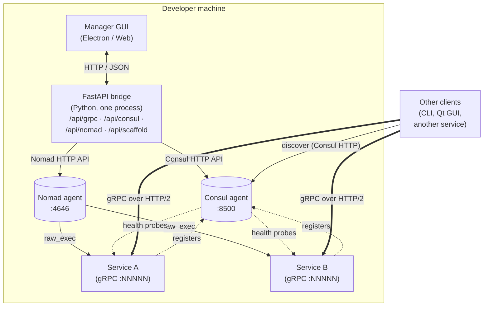
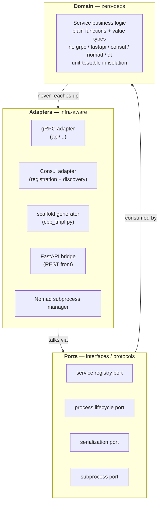
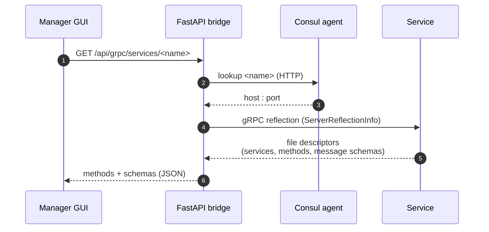
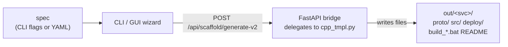

# Architecture

> 📄 *Also available as HTML:* [`architecture.html`](architecture.html)

A walk through the major pieces of MicroserviceBase, what they do, and
how they connect. For the lifecycle of a single running service, see
[`runtime_model.md`](runtime_model.md). For a glossary of unfamiliar
terms, see [`concepts.md`](concepts.md).

> **Canonical diagram**: the multi-node Consul + Nomad cluster topology
> with the wrapper layer is in
> [`diagrams/00_canonical_architecture.puml`](diagrams/00_canonical_architecture.puml)
> (single source of truth, adapted from the TA reference architecture).
> The simplified Mermaid below shows the same shape inline; for the
> deeper component view (Nomad server + 3 clients, Consul gossip ring,
> Robot Framework / grpcurl test paths), open the PUML.
>
> Audit status of all ADRs and diagrams during the post-migration
> alignment pass: [`adr/AUDIT.md`](adr/AUDIT.md) and
> [`diagrams/AUDIT.md`](diagrams/AUDIT.md).

## High-level picture



Three independent runtime processes (Consul agent, Nomad agent, the
service binary) plus the FastAPI bridge that ties them together for
the GUI. Service binaries are launched by Nomad as child processes
under `raw_exec`; they register in Consul on startup and deregister on
clean shutdown.

## The hexagonal layers

Inside any one service binary or the framework itself:



| Layer | Lives in | Imports | Imported by |
|---|---|---|---|
| **Domain** | `MicroserviceBase/domain/` and `<service>/src/<svc>/domain/` | nothing infra | adapters via ports |
| **Ports** | `MicroserviceBase/ports/` | typing only | both |
| **Adapters** | `MicroserviceBase/adapters/` and `<service>/src/<svc>/adapters/` | grpc, consul, fastapi, etc. | top-level wiring (`main.cpp`/`main.py`) |

The hexagonal split means: changing the transport (e.g. swapping a
service from MSYS2's gRPC to vcpkg's gRPC) is purely an adapter
problem; the domain code never moves. Same when we replaced the old
RabbitMQ adapter with the gRPC adapter — the domain didn't change.

## Service discovery: Consul

Every service registers itself in Consul on startup with:

- **Name**: snake-case service name (e.g. `analog_input_service`)
- **Address + port**: where its gRPC server is listening (Nomad-allocated port via `${NOMAD_PORT_grpc}`)
- **Health check**: a TCP probe to the gRPC port, polled by Consul every few seconds
- **Tags**: `v1` (or whatever the service version is)
- **Meta**: `grpc_services` = comma-separated list of fully-qualified gRPC service names the binary implements (lets the GUI skip the reflection round-trip when listing services to enumerate)

Clients resolve via `GET /v1/health/service/<name>?passing=true`,
which returns the healthy address:port pairs. The Manager GUI uses
this for its Services sidebar; `ServiceClient` uses it for outbound
gRPC calls.

Local-dev typically runs `consul agent -dev`, which is single-node
in-memory. The Manager GUI's Service Network → Consul tab can launch
this for you (see [`ops_consul_nomad.md`](../MicroserviceBase/MicroserviceManagerGUI/docs/md/ops_consul_nomad.md)).

## Orchestration: Nomad

Each generated service ships a `deploy/<service>.nomad.hcl` job that
declares:

- A single task running the service binary under `raw_exec`
- A dynamic port labelled `grpc` (Nomad picks free, exports as `${NOMAD_PORT_grpc}` env var)
- Environment vars to point the binary at Consul (`CONSUL_ADDR`)

Submit with `nomad job run deploy/<svc>.nomad.hcl` (or via the GUI's
Nomad tab → Submit Job dialog).

`raw_exec` runs the process directly (no container) so the same job
works on Windows + Linux without Docker / cgroups setup. For
production you can swap to `exec` (Linux container) or `docker`
without changing the framework — only the `.hcl` template.

## Method discovery: gRPC server reflection

Servers built with our scaffold include
`grpc++_reflection` (vcpkg overlay-port forces it on; see
[`changelog.md`](changelog.md)) and call
`grpc::reflection::InitProtoReflectionServerBuilderPlugin()` at
startup. Clients can then enumerate services + methods + message
schemas at runtime without any `.proto` file:



Fallback: when reflection isn't available (older servers, custom
builds), the bridge can compile local `.proto` files via
`grpc_tools.protoc` and use the descriptors that way. See the
`LocalProtoClient` in `MicroserviceBase/adapters/grpc_bridge/reflect_client.py`.

## The FastAPI bridge

The bridge is a single Python process that:

1. Hosts the Manager GUI's static assets at `/` (when running in browser mode)
2. Exposes REST endpoints for everything the GUI does:
   - `/api/scaffold/...` — generate service projects (mb-scaffold backend)
   - `/api/grpc/...` — list methods + invoke (via reflect_client)
   - `/api/consul/...` — start/stop the agent + read the catalog
   - `/api/nomad/...` — start/stop the agent + submit/stop jobs
3. Manages Consul + Nomad agents as Python subprocesses (PID-tracked in `%TEMP%/msbase_*_agent.pid` for restart resilience)

The GUI is a thin client over this — every button maps to one or two
endpoints. Same endpoints are usable from `curl` / scripts when
automating.

Source: `MicroserviceBase/adapters/ui_bridge/fastapi_bridge.py`. Full
endpoint list: see "CLI equivalents" in
[`ops_consul_nomad.md`](../MicroserviceBase/MicroserviceManagerGUI/docs/md/ops_consul_nomad.md).

## The scaffold generator

`mb-scaffold` (`python -m MicroserviceBase.tools.scaffold_cli`) emits
a complete service project from a small spec:



Source: `MicroserviceBase/adapters/scaffold/cpp_tmpl.py` (~7000 lines
of templated emitters — one function per output file). The same code
backs both the GUI wizard and the CLI.

## Why these choices

| Decision | Why |
|---|---|
| gRPC over a message broker | Direct point-to-point, no central bottleneck or single-PoF, native streaming, on-the-wire schema introspection via reflection |
| Consul for discovery | Battle-tested, single binary, dev mode is one command, well-documented HCL |
| Nomad for orchestration | Same vendor as Consul (no integration glue), `raw_exec` covers Windows-host dev, scales to docker/exec without changing the framework |
| Hexagonal architecture | Switching transports (RabbitMQ → gRPC) was a contained refactor — no domain code touched |
| Scaffold generator | Boilerplate is ~80% of every service; keeping it in a generator means one place to fix the gRPC reflection patch instead of N |
| Bundled GUI as a separate web app (not a Qt one) | Same code runs in Electron + headless browser; service-side GUI plugins are just HTML+JS dropped into `web/services/` |

## Where things live

```
MicroserviceBase/
├── domain/           ← framework domain (request/response types, settings)
├── ports/            ← protocol abstractions (registry, transport, lifecycle)
├── adapters/
│   ├── grpc_bridge/  ← reflect_client, LocalProtoClient (the bridge's gRPC client)
│   ├── ui_bridge/    ← FastAPI bridge (REST front)
│   ├── scaffold/     ← cpp_tmpl.py (the generator)
│   └── consul_*      ← Consul SDK adapter
├── runtime/          ← Python ServiceRunner + ServiceClient
├── runtime_cpp/      ← C++ ServiceRunner (header library) + CMake glue
├── tools/            ← scaffold_cli (mb-scaffold)
└── MicroserviceManagerGUI/  ← Electron + browser app (its own README)
```

For per-component code-level reference, the doc-comments in each file
are the source of truth — these architecture docs describe the shape,
not the API.

## See also

- [`runtime_model.md`](runtime_model.md) — what happens inside one service from `main()` to first RPC handled
- [`concepts.md`](concepts.md) — terminology
- [`changelog.md`](changelog.md) — what this architecture replaced
- [`adr/`](adr/) — per-decision rationale
