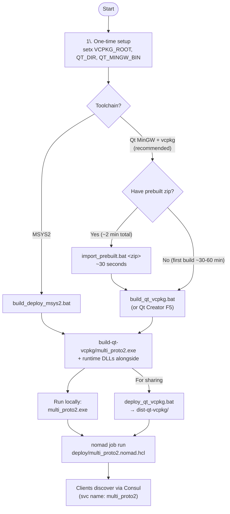

# MultiProto2

MultiProto2 multi-service binary.

**Layout**: `multi_proto` — 2 gRPC services hosted in ONE
binary, ONE Consul registration, ONE port (vehicle-example pattern).

## Hosted services

- **ComSetupDeviceService** — proto `com_config_device.proto`, package `Com_Setup_Device`, 8 method(s)
- **PowerSupplyService** — proto `power_device.proto`, package `power_device`, 12 method(s)

## Folder structure

`[edit]` marks files you'll write business logic into.  Everything else
is scaffolding regenerated by `mb-scaffold` — safe to leave alone.

```
MultiProto2/
├── proto/                       # N .proto files (one per service, each with its own package)
│   ├── com_config_device.proto
│   ├── power_device.proto
├── src/
│   ├── main.cpp                 # registers ALL services on one ServerBuilder
│   ├── Settings.h               # shared config (env prefix MULTI_PROTO2_)
│   ├── com_setup_device_service/                # ComSetupDeviceService (proto `com_config_device.proto`)
│   │   ├── domain/ComSetupDeviceService.{h,cpp}      # [edit] business logic (pure C++)
│   │   └── adapters/api/ComSetupDeviceServiceGrpcAdapter.{h,cpp}  # [edit] proto<->domain wrapper
│   ├── power_supply_service/                # PowerSupplyService (proto `power_device.proto`)
│   │   ├── domain/PowerSupplyService.{h,cpp}      # [edit] business logic (pure C++)
│   │   └── adapters/api/PowerSupplyServiceGrpcAdapter.{h,cpp}  # [edit] proto<->domain wrapper
├── deploy/multi_proto2.nomad.hcl  # Nomad job (single .exe, dynamic port)
├── client/                      # console client subproject
│   ├── src/client.cpp           # interactive RPC tester (Consul or --direct)
│   └── CMakeLists.txt
├── CMakeLists.txt               # one add_executable, N proto codegens
├── build_deploy.bat / .sh       # one-shot build for the server binary
├── set_env*.bat / .sh           # toolchain env (VCPKG_ROOT, QT_DIR, etc.)
└── README.md
```

## Build & run flow



## Build (quick)

```cmd
build_deploy.bat        :: Windows MSYS2 path
build_qt_vcpkg.bat      :: Windows Qt MinGW + vcpkg path
./build_deploy.sh       # Linux
```

Output: one executable `build*/multi_proto2.exe` listening on
`$MULTI_PROTO2_GRPC_PORT` (Nomad-allocated when run under Nomad).
gRPC server reflection enumerates every hosted service so generic
clients (Manager GUI, `grpcurl`) discover them transparently.

## Why multi_proto vs. monorepo

Use **multi_proto** (this layout) when the services are:
- conceptually one device with multiple functional surfaces
  (e.g. PowerSupply: configuration + control), AND
- always co-deployed (one binary, one process), AND
- benefit from sharing a Consul registration / port / lifecycle.

Use **monorepo** when services are independent enough to be deployed
separately (each gets its own .exe, its own Consul registration,
its own port).
