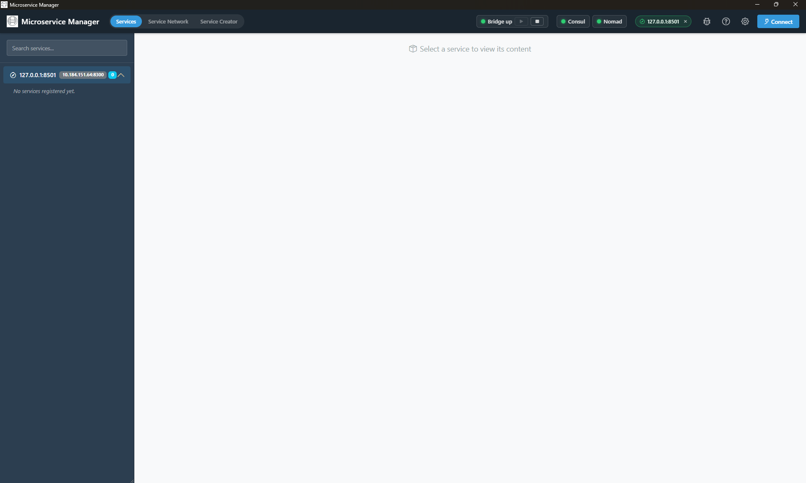
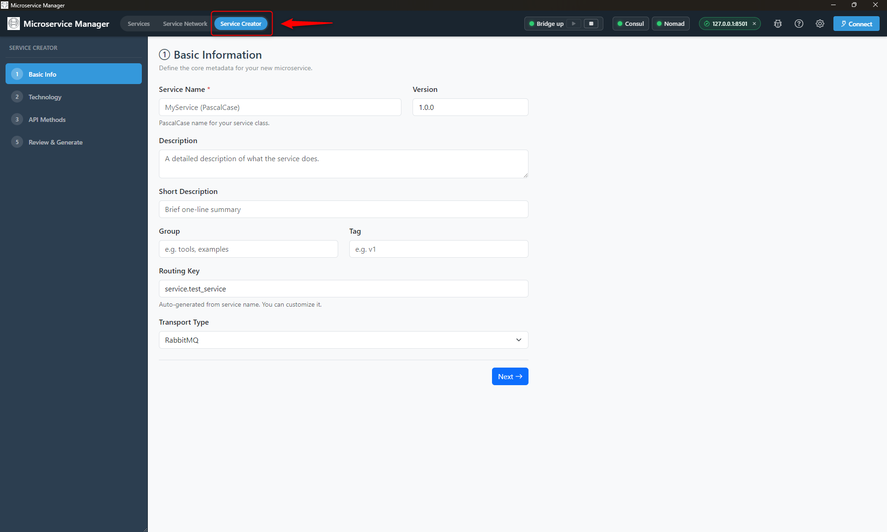
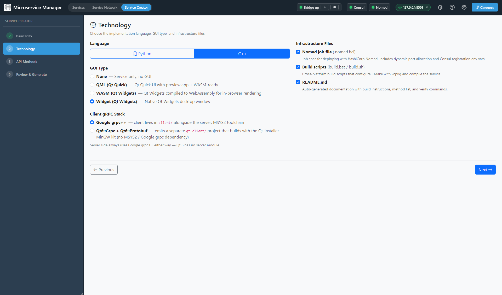
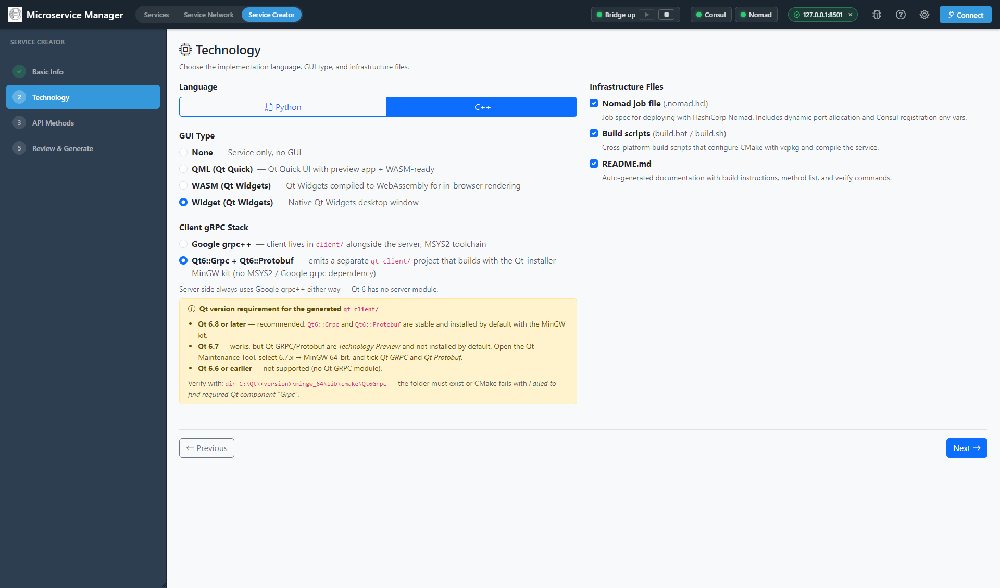
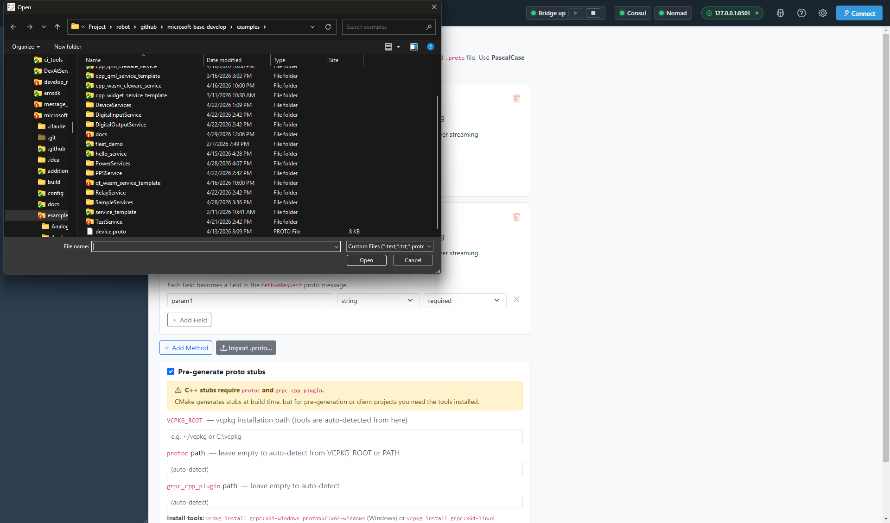
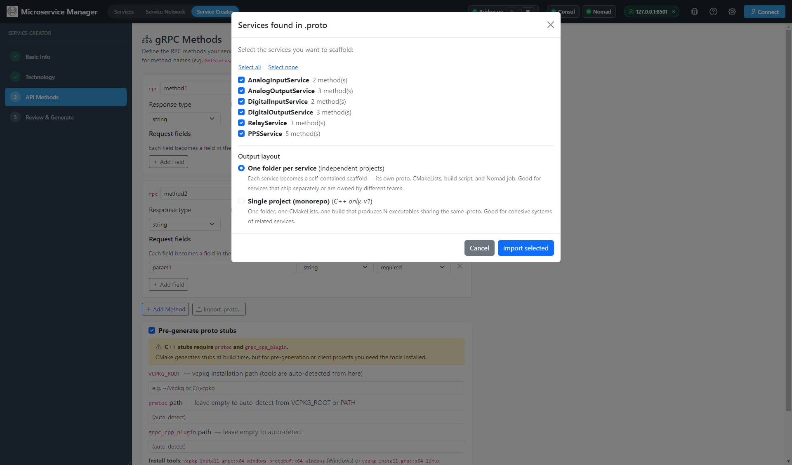

# Service Creator Wizard — Manager GUI

Generate a complete service scaffold (proto + domain + adapter + build
scripts + clients + Nomad spec) from the Manager GUI without writing
any boilerplate yourself.

> 📄 *Also available as HTML:* [`../html/gui_wizard.html`](../html/gui_wizard.html)
>
> Companion docs: [← Docs index](index.md) ·
> [MinGW (MSYS2) setup](mingw_setup.md) ·
> [Qt6::Grpc setup](qt_grpc_setup.md) ·
> [Service creation tutorial (manual)](service_creation.md)

---

## When to use the wizard

| You want to… | The wizard is the right tool? |
|---|---|
| Create a brand-new service from a description of methods | ✅ Yes |
| Import an existing `.proto` file and get a matching server + client | ✅ Yes — `Import .proto…` button on Step 3 |
| Generate multiple services from one .proto (monorepo) | ✅ Yes — pick "Single project (monorepo)" on the import dialog |
| Edit an *existing* service | ❌ No — edit the source files directly. Re-running the wizard would overwrite. |
| Add a single new RPC to an existing service | ❌ No — easier to edit `.proto` + adapter by hand. See [service_creation.md](service_creation.md). |

The wizard is equivalent to `mb-scaffold` (the
[command-line tool](#alternative-the-mb-scaffold-cli)) — same generator
backend, just nicer to drive interactively.

---

## Prerequisites

1. **MicroserviceBase Manager GUI** running. See the
   [Manager GUI setup](#starting-the-manager-gui) below.
2. **Bridge** running (the GUI launches it automatically; for headless
   use start with
   `python -m MicroserviceBase.adapters.ui_bridge.fastapi_bridge`).
3. *(For C++ scaffolds)* The toolchain you'll build with —
   [MinGW (MSYS2)](mingw_setup.md) for Google grpc++ services or
   [Qt-installer](qt_grpc_setup.md) for Qt-native clients.

---

## Starting the Manager GUI

### One-time fresh-PC setup

```cmd
cd MicroserviceBase\MicroserviceManagerGUI
setup_and_start.bat
```

This downloads a portable Node.js (~30 MB), runs `npm install`, and
launches the GUI. Subsequent runs skip the download — just
`npm start` or re-run `setup_and_start.bat`.

### From an existing dev install

```cmd
cd MicroserviceBase\MicroserviceManagerGUI
npm start
```

The Electron window opens. The bridge starts in the background on
`http://127.0.0.1:1112`.



The header shows the active **Bridge**, **Consul**, and **Nomad**
status pills plus a quick **Connect** button for brokers. The left
sidebar lists registered services (empty here because no service is
running yet).

---

## Reaching the wizard

Click the **Service Creator** tab in the **top navigation bar** —
between *Services* and *Service Network*. It opens the wizard in the
main pane.



You don't need a broker connection to use the wizard — it talks
directly to the bridge over its REST API.

---

## Step 1 — Basic Info

The first step captures the project's identity and metadata.


| Field | Required | Notes |
|---|---|---|
| **Service Name** | ✅ | PascalCase. Becomes the project folder name, the C++ class name, and (for monorepo) the parent directory. e.g. `SampleService`, `PowerServices`. |
| **Version** | ✅ | Semver. Default `1.0.0`. Surfaces in the .proto package, generated CMake `project(... VERSION ...)`, and `service_config.json`. |
| **Description** | optional | Longer free-text. Goes into the README. |
| **Short Description** | optional | One-liner for the Manager GUI's service card. |
| **Group** | optional | Logical grouping shown in the GUI sidebar (e.g. "Sensors", "pps"). |
| **Tag** | optional | Free-form tag string (e.g. `v1`). |
| **Routing Key** | auto | Auto-generated from the service name (e.g. `service.sample_service`); editable. Used by the message-broker transport. |
| **Transport Type** | dropdown | `RabbitMQ` is the current default. |

> **Naming tip.** If you're going to import a `.proto` later, set
> Service Name to whatever the proto's `service X { ... }` block
> declares. That way the generator doesn't have to choose for you.

Click **Next** to advance.

---

## Step 2 — Technology

Pick the language, GUI variant, and infrastructure files to generate.

### Language

| Choice | Generates |
|---|---|
| **Python** | `runtime/`-style Python service with FastAPI bridge integration. GUI options are `none` or `html` only. |
| **C++** | CMake project, hexagonal architecture, Google grpc++ server. GUI options expand to include Qt variants. |

### GUI Type

| Variant | Output | Toolchain doc |
|---|---|---|
| **None** | Service-only, no UI | — |
| **HTML / JS** *(Python only)* | Browser-based UI loaded by Manager GUI | — |
| **Widget** *(C++)* | Native Qt Widgets desktop client | [MinGW setup](mingw_setup.md) |
| **QML** *(C++)* | Qt Quick UI in C++ client | [MinGW setup](mingw_setup.md) |
| **WASM** *(C++)* | Qt Widgets compiled to WebAssembly | [WASM service guide](wasm_cleware_service_guide.md) |

### Client gRPC Stack *(C++ only, when GUI ≠ None)*

Three options, all wire-compatible (you can mix any client variant
with any server):

| Choice | Where client lives | Toolchain | What you get |
|---|---|---|---|
| **Google grpc++** *(default)* | `client/` (next to server) | MSYS2 MinGW (same as server) | Console + optional Qt6 Widgets GUI from MSYS2's qt6-base. JSON-based dispatch via `google::protobuf::util::JsonStringToMessage`. |
| **Qt6::Grpc + Qt6::Protobuf** | `qt_client/` (separate project) | Qt-installer MinGW (separate from server) | Qt-native RPC types with signal/slot integration. **Requires Qt 6.8+ with Qt GRPC + Qt Protobuf modules.** Server stays on MSYS2. See [Qt6::Grpc setup](qt_grpc_setup.md). |
| **Google grpc++ via vcpkg + Qt MinGW** | `qt_client_grpcpp/` (separate project) | Qt-installer MinGW (same as server) | One toolchain end-to-end. vcpkg builds grpc/protobuf/abseil with Qt's MinGW. **First build ~30–60 min**; subsequent instant via cache. Also re-targets the server's CMakeLists to use vcpkg. See [vcpkg setup](vcpkg_setup.md). |

If you pick **Qt6::Grpc**, the wizard shows a yellow alert with the Qt
version requirements — don't skip reading it; Qt 6.7 has the modules
as Tech Preview (must be ticked manually in Qt Maintenance Tool), Qt
6.6 doesn't have them at all.

If you pick **Google grpc++ via vcpkg + Qt MinGW**, the wizard shows a
blue prerequisites alert reminding you to set `VCPKG_ROOT`,
`QT_MINGW_BIN`, and `QT_DIR` before running `build_qt.bat`. First-time
build is slow because vcpkg compiles boringssl + abseil + protobuf +
grpc from source with Qt's gcc.

**With Google grpc++ selected** — the simplest case, no Qt-installer
needed:



**With Qt6::Grpc selected** — the alert with the version requirements
appears below the radio:



**With Google grpc++ via vcpkg + Qt MinGW selected** — emits
`qt_client_grpcpp/` plus shared `triplets/` and `ports/` overlays at
project root. See the [vcpkg setup guide](vcpkg_setup.md) for the
prerequisites and full workflow including the gcc 13.1.0 ICE
workaround patch the generator emits automatically.

### Server Toolchain *(C++ only)*

Independent of the Client gRPC Stack choice. The server is always
Google grpc++; the toggle just picks how it's compiled and from which
prebuilt:

| Choice | What you get |
|---|---|
| **MSYS2 prebuilt** *(default)* | `mingw-w64-x86_64-grpc` from MSYS2's pacman tree. Build via `build_deploy_msys2.bat`. No vcpkg required. |
| **vcpkg + Qt MinGW** | grpc/protobuf/abseil compiled by vcpkg with the Qt-installer MinGW 13.1.0. Build via `build_qt_vcpkg.bat`. Emits the same shared `triplets/` + `ports/` overlay used by `qt_client_grpcpp/`. |

The wizard auto-suggests `vcpkg` for the server when you pick
`google_vcpkg` for the client (one toolchain end-to-end), but the
toggle is independent — you can pick any combination. The two notable
cases:

- **Client `google_vcpkg` + Server `msys2`** → mixed toolchains.
  Wire-protocol still works, but client and server use different
  libstdc++ ABIs. Wizard shows a warning.
- **Client `google` or `qt` + Server `vcpkg`** → server-only vcpkg.
  The `vcpkg install` populates a cache that's reusable later if you
  switch the client to `google_vcpkg` (same triplet, same overlay).
  Wizard shows an info note.

### Infrastructure files

Three checkboxes for what's generated alongside the service:

- **Nomad job file** (`<service>.nomad.hcl`) — for Nomad deployment
- **Build scripts** (`build_deploy*.bat/sh`) — MSVC, MinGW, MSYS2 variants
- **README.md**

All on by default. Untick any you don't need.

### Nomad knobs *(only shown when "Nomad job file" is ticked)*

- `nomad_dc` — Datacenter name (default `dc1`)
- `nomad_driver` — `raw_exec` (default) or `docker`
- `nomad_cpu` — millihertz (default 100)
- `nomad_mem` — MB (default 128)
- `nomad_consul_addr` — Consul HTTP API URL

Click **Next**.

---

## Step 3 — Methods

Define the RPC methods. Two paths:

### A. Manual entry

Click **Add Method** and fill in:

| Field | Notes |
|---|---|
| **Name** | PascalCase, e.g. `Greet`, `ReadAnalogInput` |
| **Description** | Goes into the .proto comments + README |
| **Server streaming** | Tick if the method returns `stream <Response>` |
| **Return type** | Conventionally a single field. Default `string`. |
| **Parameters** | Each row: name, type (`string` / `int32` / `bool` / `float` / `double` / `bytes`), required flag, description |

The wizard generates a corresponding `.proto` with `<Method>Request`
and `<Method>Response` messages following the parameter list.


The lower half of this step has a **Pre-generate proto stubs**
section (ticked by default for C++) — when on, the bridge runs
`protoc` at scaffold time so the project builds without needing
`generate_stubs.bat` first. You can leave the `VCPKG_ROOT` /
`protoc path` / `grpc_cpp_plugin path` fields blank for auto-detect.

### B. Import from a `.proto` file

Click **Import .proto…** and pick an existing `.proto` from the OS
file picker:



The bridge parses it via `protoc --descriptor_set_out` and, if the
proto contains **multiple services**, opens a picker modal listing
all of them with checkboxes plus an **Output layout** choice:



| Picker option | Result |
|---|---|
| Tick services & **One folder per service** | Generator creates N sibling project folders, one per service |
| Tick services & **Single project (monorepo)** *(C++ only)* | Generator creates one project with N executables sharing the same .proto |

The imported proto's text is preserved verbatim (comments, options,
imports), only the structural metadata is read out for the wizard's
internal tracking. The adapter and domain stubs use the **real**
message types from the proto (e.g. `device::ChannelRequest`), not
fabricated `<Method>Request` names.

> **Imported proto + GUI = smart placeholder code.** Because we can't
> guess how your domain class maps to arbitrary message fields, the
> generated adapter emits `UNIMPLEMENTED` stubs with TODO comments,
> and the GUI client uses JSON serialization for any message shape.
> This compiles immediately; you fill in the body when you're ready.

Click **Next**.

---

## Step 4 — Review & Generate

> The sidebar numbers this step **5** because there's a hidden Step 4
> (GUI Schema) that only appears when you pick `language=python` +
> `gui_type=html`. For C++ flows you jump straight to the review.

The left card summarises the service:

- Service name + badges (`6 services` / `monorepo` if applicable)
- Language, GUI variant, Client gRPC stack
- Description, Group, Infrastructure files generated
- Imported proto file name
- All services + methods with their typed signatures (e.g.
  `rpc SetVoltage(channel:int32, voltage:float) → bool`)

The right pane has the **Nomad Job Configuration** form: Datacenter,
Driver (`raw_exec` / `docker`), Command path, Consul address, CPU
limit, Memory limit. Defaults are sensible; tweak as needed.


### Generating

Three buttons at the bottom:

| Button | Result |
|---|---|
| **Browse…** | Pick the output folder via OS dialog (sets the **Output Path** field). |
| **Download ZIP** | Streams a ZIP of the project tree to your browser/downloads folder. |
| **Save to Path** | Writes the scaffold to `<Output Path>/<ServiceName>/`. |

For **monorepo + import**: one Save creates a single folder with all
services. For **separate-folders + import**: the wizard makes N saves
in sequence (one per service) and shows partial success in a toast.

A success toast (bottom-right) confirms the path; a red toast surfaces
any error from the bridge.


---

## What gets generated

For a typical C++ + Widget + Google-grpc scaffold:

```
DemoService/
├── CMakeLists.txt
├── README.md
├── DemoService.nomad.hcl
├── service_config.json
├── set_env.bat / .sh / _mingw.bat / _msys2.bat
├── build_deploy.bat / .sh / _mingw.bat / _msys2.bat
├── proto/
│   ├── demo_service.proto
│   ├── generate_stubs.bat / .sh
│   ├── demo_service.pb.h / .cc
│   └── demo_service.grpc.pb.h / .cc
├── src/
│   ├── main.cpp
│   ├── Settings.h
│   ├── domain/DemoService.h / .cpp
│   └── adapters/api/DemoServiceGrpcAdapter.h / .cpp
└── client/
    ├── CMakeLists.txt
    ├── README.md
    ├── src/client.cpp
    └── gui/                 ← only when GUI ≠ None
        ├── main.cpp
        ├── MainWindow.h / .cpp / .ui
        └── ClientRegistry.h / .cpp
```

For Qt6::Grpc client mode, you additionally get `qt_client/` (a
parallel Qt-installer-toolchain project) — see
[qt_grpc_setup.md](qt_grpc_setup.md) for its layout.

For Google-grpc-via-vcpkg client mode, you additionally get
`qt_client_grpcpp/` plus shared `triplets/`, `ports/grpc/`,
`init_vcpkg_overlay.bat`, and `build_qt_vcpkg.bat` at project root.
See [vcpkg_setup.md](vcpkg_setup.md) for the layout, build flow,
and the gcc 13.1.0 ICE workaround.

For monorepo mode, you get one project folder with `src/<svc>/...`
per service and per-service `deploy/<svc>.nomad.hcl`.

---

## After generation

1. **Build**:
   - MSYS2: `build_deploy_msys2.bat` (see [mingw_setup.md](mingw_setup.md))
   - Qt-installer + Qt6::Grpc: `qt_client/build_qt.bat` (see [qt_grpc_setup.md](qt_grpc_setup.md))
   - Qt-installer + Google grpc++ (vcpkg): `qt_client_grpcpp/build_qt.bat` and `build_qt_vcpkg.bat` (server) (see [vcpkg_setup.md](vcpkg_setup.md))
2. **Start Consul + Nomad** (one-time per session):
   ```cmd
   start /b consul agent -dev -client=0.0.0.0 -ui
   start /b nomad agent -dev -config=C:\nomad\dev.hcl
   ```
3. **Run the service**:
   ```cmd
   :: From cmd:
   nomad job run deploy\<service>.nomad.hcl
   :: Or directly:
   dist-msys2\run_<service>.bat
   ```
4. **Use the GUI client**:
   ```cmd
   dist-msys2\run_<service>_gui.bat
   ```
5. **Edit the domain logic** — the generator emits TODO stubs in
   `src/.../domain/` and `src/.../adapters/api/`. Fill them in to
   wire up your business logic / hardware access.

For a worked walkthrough of editing the generated code, see
[service_creation.md](service_creation.md).

---

## Alternative: the `mb-scaffold` CLI

The wizard is a thin frontend over the same generator that
`mb-scaffold` calls. If you'd rather script it (for CI / repeat runs):

```cmd
python -m MicroserviceBase.tools.scaffold_cli ^
    --name DemoService --language cpp --gui widget ^
    --output .\out
```

Or with a YAML/JSON config file:

```cmd
python -m MicroserviceBase.tools.scaffold_cli --config demo.yaml
```

`mb-scaffold` is a friendly nickname for
`python -m MicroserviceBase.tools.scaffold_cli` — there is no installed
binary, but you can wrap the long form in a `mb-scaffold.bat` on your
`PATH` if you use it often. Requires the bridge to be running
(`http://127.0.0.1:1112` by default; set with `--bridge-url` or
`MB_BRIDGE_URL`).

### Config file structure (`demo.yaml`)

The CLI accepts YAML or JSON. Only `service_name` and `output_path` are
required (and you can pass them via `--name` / `--output` instead).

**Minimal example**:

```yaml
service_name: HelloService
output_path: ./out
language: cpp
```

**Full example** — single service, C++ Qt widget client built with the
vcpkg + Qt MinGW toolchain:

```yaml
service_name: HelloService
version: "1.0.0"
description: "Demo service"
short_desc: "Hello"
group: "demo"
tag: "v1"

language: cpp                  # python | cpp
gui_type: widget               # none | html | qml | wasm | widget
client_grpc_kind: google_vcpkg # google | qt | google_vcpkg
server_grpc_kind: vcpkg        # msys2 | vcpkg
output_path: ./out

# Generation toggles (defaults shown)
gen_nomad:         true
gen_build_scripts: true
gen_readme:        true
gen_stubs:         true

# Toolchain hints (only when scripts can't auto-detect)
vcpkg_root: ""                 # default: $VCPKG_ROOT
protoc_path: ""                # default: $PATH lookup
grpc_plugin_path: ""

# Nomad job template
nomad_dc:          "dc1"
nomad_driver:      "raw_exec"
nomad_command:     ""           # auto-derived from service_name if empty
nomad_cpu:         100          # MHz
nomad_mem:         128          # MB
nomad_consul_addr: "http://127.0.0.1:8500"

# RPC methods
methods:
  - name: SayHello
    description: "Greet a caller by name"
    return_type: string
    server_streaming: false
    params:
      - name: name
        type: string            # string|int32|int64|uint32|uint64|bool|float|double|bytes|...
        required: true
        description: "Caller name"

# Verbatim .proto override (skip auto-synth from methods)
proto_content_override: ""
proto_package: ""               # only set when proto_content_override is set
```

**Monorepo example** — one project, N executables (one per service):

```yaml
service_name: PowerDeviceService
output_path: ./out
language: cpp
gui_type: widget
client_grpc_kind: google_vcpkg
server_grpc_kind: vcpkg
monorepo: true                  # ← key flag
proto_package: power.v1

services:                       # ← list of services instead of `methods`
  - name: AnalogInputService
    methods:
      - name: ReadChannel
        params: [{name: channel, type: int32}]
        return_type: double
      - name: ReadAllChannels
        return_type: string
        server_streaming: true

  - name: RelayService
    methods:
      - name: SetRelay
        params: [{name: id, type: int32}, {name: state, type: bool}]
        return_type: bool
```

### Field reference

| Field | Type | Default | Notes |
|---|---|---|---|
| `service_name` | str | **required** | Top-level service name (or monorepo project name) |
| `version` | str | `"1.0.0"` | |
| `description` / `short_desc` / `group` / `tag` | str | `""` | Metadata only |
| `language` | str | `"python"` | `python` \| `cpp` |
| `gui_type` | str | `"none"` | `none` \| `html` \| `qml` \| `wasm` \| `widget` |
| `client_grpc_kind` | str | `"google"` | `google` \| `qt` \| `google_vcpkg` (only when `gui_type != "none"`) |
| `server_grpc_kind` | str | `"msys2"` | `msys2` \| `vcpkg` — independent of client |
| `gen_nomad` / `gen_build_scripts` / `gen_readme` / `gen_stubs` | bool | `true` | |
| `vcpkg_root` / `protoc_path` / `grpc_plugin_path` | str | `""` | Override autodetect |
| `nomad_dc` | str | `"dc1"` | |
| `nomad_driver` | str | `"raw_exec"` | |
| `nomad_command` | str | `""` (auto) | |
| `nomad_cpu` / `nomad_mem` | int | `100` / `128` | MHz / MB |
| `nomad_consul_addr` | str | `"http://127.0.0.1:8500"` | |
| `methods` | list[Method] | `[]` | Single-service mode |
| `services` | list[Service] | `[]` | Monorepo mode (`monorepo: true`) |
| `output_path` | str | **required** | Service folder is created inside this |
| `monorepo` | bool | `false` | |
| `proto_content_override` | str | `""` | Verbatim `.proto` text |
| `proto_package` | str | `""` | When overriding proto |

**Method object**:

```yaml
- name: MyRpc                # required
  params: []                 # list of Param objects
  return_type: string        # primitive — used to synth *Response message
  description: ""
  server_streaming: false    # → stream<...> on the return side
  input_type:  ""            # fully-qualified proto type (imported protos only)
  output_type: ""            # fully-qualified proto type (imported protos only)
```

**Param object**:

```yaml
- name: foo                  # required
  type: string               # string|int32|int64|uint32|uint64|bool|float|double|bytes|...
  required: true
  description: ""
```

**Service object** (only used in monorepo `services:` list):

```yaml
- name: MyService
  methods: [<Method>, ...]
```

### Inline-flag overrides

Flags compose with the config — flag values win. Useful flags:

| Flag | Maps to |
|---|---|
| `-c FILE` / `--config FILE` | Load YAML/JSON config |
| `-n NAME` / `--name NAME` | `service_name` |
| `-l LANG` / `--language LANG` | `language` |
| `--gui {none,html,qml,wasm,widget}` | `gui_type` |
| `--client-grpc {google,qt,google_vcpkg}` | `client_grpc_kind` |
| `--server-grpc {msys2,vcpkg}` | `server_grpc_kind` |
| `-o DIR` / `--output DIR` | `output_path` |
| `--version VER` | `version` |
| `--description TEXT` | `description` |
| `--proto FILE` | Import `.proto` (overrides `methods`/`services`) |
| `--proto-service NAME` | Pick one service from a multi-service `.proto` |
| `--monorepo` | `monorepo: true` |
| `--no-nomad` / `--no-build-scripts` / `--no-stubs` | Disable generation toggles |
| `--bridge-url URL` | Override bridge endpoint (default `$MB_BRIDGE_URL` or `http://127.0.0.1:1112`) |
| `--dry-run` | Print the resolved JSON payload and exit |
| `-q` / `--quiet` | Print only the target path on success |

### Verify the config before sending

`--dry-run` prints the resolved JSON the CLI would POST to the bridge —
the easiest way to check that your YAML maps to the expected fields:

```cmd
python -m MicroserviceBase.tools.scaffold_cli -c demo.yaml --dry-run
```

---

## Troubleshooting

| Symptom | Fix |
|---|---|
| Service Creator button does nothing | Bridge not running. Check `http://127.0.0.1:1112/health` returns 200. Restart the Manager GUI. |
| "Failed to reach bridge" toast | Same as above, plus check no other process holds port 1112 (`netstat -ano \| findstr :1112`). |
| Import .proto returns "parse error" | The proto is malformed or uses syntax the bundled `protoc` doesn't support. Test with: `protoc --descriptor_set_out=NUL your.proto` |
| Import .proto succeeds but "service picker" is empty | Your .proto has no `service X { ... }` block — only messages. Add at least one service. |
| Generated build fails with "fabricated `<Method>Request` not declared" | Old generator bug. Make sure you're on the latest commit and regenerate. |
| Save succeeds but folder is empty | Bridge couldn't write to `output_path` — check write permissions. Defaults to wherever the bridge process runs. |
| C++ + Qt6::Grpc + monorepo emits two folders (`client/` and `qt_client/`) | This is intentional. `client/` has the Google-grpc console client (works without Qt installer); `qt_client/` is the Qt-native UI client. Use whichever fits. |

